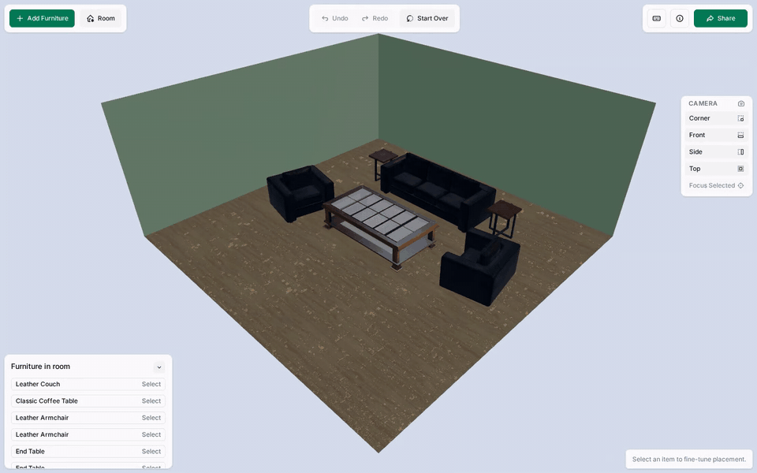
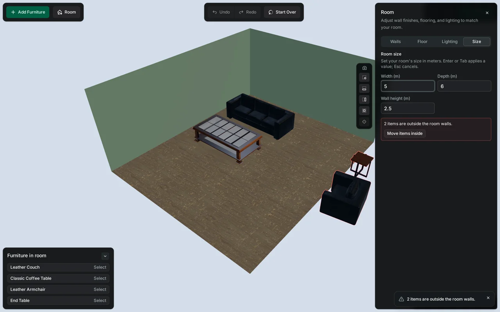
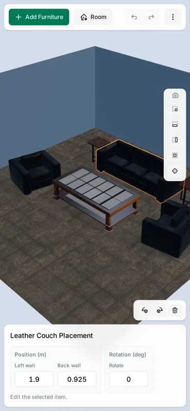

# 3D Room Layout Editor

See how catalog furniture fits your space: an interactive 3D furniture arrangement and room configuration tool built with React and Three.js.

<https://christopher-r-anderson.github.io/room-layout/>



<p>
  
  
</p>

Left: shrinking the room never moves furniture - stranded items get warning
outlines and an explicit, undoable "Move items inside" fix. Right: on phones
the selected-item toolbar docks above the details panel instead of floating.

Pick furniture from a visual catalog, arrange items in real time, adjust room surfaces without leaving the layout, and share your setup via URL.

## Design Highlights

- **Environment-first startup**: The room is interactive in seconds while furniture streams in on demand; a shared or restored layout gates only on the collections it actually references
- **Collision-aware placement**: Furniture stays in valid positions through bounds and collision checks
- **Keyboard-first workflows**: Canvas interaction, item selection via outliner, and details editing all work without drag
- **Accessible dialog contracts**: Focus management, Escape behavior, and role semantics across overlays and confirmations
- **Non-modal room editing**: Adjust wall and floor finishes while viewing the result in context, no mode-switching overhead
- **Selected-item toolbar**: Floats beside the selected object on desktop, taking a clamped best-effort position when no clean spot survives; docks above the details panel on phones
- **Zero-shift loading handoff**: The pre-paint HTML skeleton and the React loader mirror each other, so the spinner holds its position across the JavaScript handoff
- **Download and asset failure handling**: Stall-aware streaming downloads, permanent-vs-transient failure classification (broken items marked unavailable in the catalog), and a retry path for everything up to a stale deploy's missing chunk

## Quick Start

```bash
pnpm install
pnpm dev
```

Open the app at the local URL shown by Vite.

## Using the Editor

For a user-facing walkthrough, see [docs/guide/user-guide.md](docs/guide/user-guide.md).

- Add furniture from `Add Furniture`, then select items in the room or from the
  `Furniture in room` panel.
- Move and rotate selected items with direct manipulation, selected-item
  controls, or keyboard shortcuts.
- Open `Room` to change floor and wall finishes without leaving the editor.
- Use `Share` on desktop or the mobile `More actions` menu to generate a
  shareable room URL.

Shortcut details are documented in
[docs/reference/editor-shortcuts-reference.md](docs/reference/editor-shortcuts-reference.md).

## Development

```bash
pnpm dev          # start dev server
pnpm lint         # run ESLint
pnpm typecheck    # run TypeScript checks
pnpm test:run     # run unit tests
pnpm test:e2e     # run browser integration tests (first run: pnpm test:e2e:install)
pnpm fix          # apply lint and format fixes
pnpm preflight    # full gate before substantial changes
```

The full script list - build and preview, bundle analysis, coverage, knip,
i18n extraction, and the asset export pipelines - is in `package.json`.

## Testing

Use lane-specific tests based on the change scope:

- `pnpm test:run`: unit and integration checks
- `pnpm test:e2e`: browser workflow coverage

Detailed testing workflow guidance lives in `docs/architecture/testing.md`.
It also includes first-time Playwright setup and test artifact locations.

## Accessibility

Accessibility is an explicit goal for this project, especially for no-mouse editor workflows.

- Keyboard-first workflows are a primary product requirement.
- Room-view shortcuts are scoped to room-view focus.
- Furniture-in-room panel acts as the primary text alternative to direct canvas interaction.
- Accessibility checks run through Playwright + axe in Chromium, plus manual assistive-tech verification.
- Toolbar, disabled-state, and inert conventions live in [Interactivity](docs/architecture/interactivity.md).

The Playwright config starts a local Vite server automatically, so browser
tests do not require a separate manual `pnpm dev` session.

## Deployment

This repository deploys automatically to GitHub Pages via GitHub Actions.

- Trigger: push to `main` (or manual workflow dispatch)
- Workflow: `.github/workflows/deploy-pages.yml`
- Publish target: `dist/` output from `pnpm build`
- Base path: set automatically in CI as `/${repository-name}/`

Production builds in GitHub Actions derive the base path from the repository name, which keeps forks and renamed repositories portable.

For local production builds, the default fallback remains `/room-layout/`. If needed, override it explicitly:

```bash
VITE_BASE_PATH=/your-repo-name/ pnpm build
```

`localStorage` keys are namespaced per deployment: the instance segment derives
from the base path; set `VITE_STORAGE_INSTANCE` to override it (see
[Configuration](docs/architecture/configuration.md)).

Current deployment URL:

<https://christopher-r-anderson.github.io/room-layout/>

## Documentation

In addition to this README, project-specific guides are available:

### Architecture

- [Architecture](docs/architecture/architecture.md): Layer map, layer intent, and placement rules.
- [Decision Records](docs/decisions/README.md): Dated records of major decisions - their context, the alternatives weighed, and their consequences.
- [Core](docs/architecture/core.md): The core layer - stores, operations, commands, and persistence.
- [Scene and Core](docs/architecture/scene-and-core.md): The data-model/engine seam - who owns furniture data vs. the rules that change it.
- [Startup and Asset Loading](docs/architecture/startup-and-asset-loading.md): Startup phases, the bundle split, and the collection load pipeline.
- [Dialogs and Overlays](docs/architecture/dialogs-and-overlays.md): The active-surface dialog/overlay model, blocking semantics, mutual exclusion, and focus return.
- [Focus Routing](docs/architecture/focus.md): How keyboard focus moves between the editor's surfaces.
- [Interactivity](docs/architecture/interactivity.md): Toolbar composites, disabled-state expression, and the inert seam.
- [Feedback](docs/architecture/feedback.md): Routing user feedback to toasts and screen-reader announcements.
- [Configuration](docs/architecture/configuration.md): Configuration tiers and the storage instance key.
- [Internationalization](docs/architecture/i18n.md): Lingui + `Intl` localization, per-locale catalog splitting, string authoring, and adding a locale.

### Contributor Workflows

- [Testing Guide](docs/architecture/testing.md): Contributor test lane selection and browser test workflow guidance.
- [Intentional Unit-Test Exclusions](docs/testing/intentional-unit-exclusions.md): The standing record of code deliberately not unit-tested, with where it is covered instead.
- [Catalog and Assets](docs/architecture/catalog-and-assets.md): Manifest editing, validation, texture and model pipelines, and asset contract notes.
- [Catalog Manifest Schema](docs/reference/catalog-manifest-schema.md): Full catalog manifest field reference and validation constraints.
- [UI Components Policy](docs/architecture/ui-components.md): shadcn ownership model and the logical CSS property convention.

### Feature and Behavior References

- [User Guide](docs/guide/user-guide.md): End-user workflows and controls overview.
- [URL Scene Sharing](docs/guide/url-scene-sharing.md): Shared URL payload and restore behavior.
- [Assets Attribution](docs/reference/assets-attribution.md): third-party asset source and license attribution.
- [Editor Shortcuts Reference](docs/reference/editor-shortcuts-reference.md): End-user shortcut map for camera, object, and scene actions.
- [Keyboard Shortcuts (Engineering)](docs/architecture/keyboard.md): Input architecture, matching/suppression/execution rules, and held-key camera behavior.
- [Selected Toolbar Placement](docs/architecture/selected-toolbar-placement.md): Bounds source order, viewport-space placement, floating candidate scoring, and clamped fallback behavior.

### Automation

- [AGENTS.md](AGENTS.md): Agent guide (`CLAUDE.md` imports it).

Local architecture notes are also available in:

- `src/app/README.md`
- `src/features/README.md`
- `src/core/README.md`
- `src/domain/README.md`
- `src/shared/README.md`
- `src/scene/README.md`
- `src/test/README.md`

## License

This project source code is licensed under the MIT License. See [LICENSE](./LICENSE).

Third-party furniture assets in this repository remain under their
original CC Attribution 4.0 licenses.

Third-party environment texture assets in this repository remain under
their original CC0 licenses.
