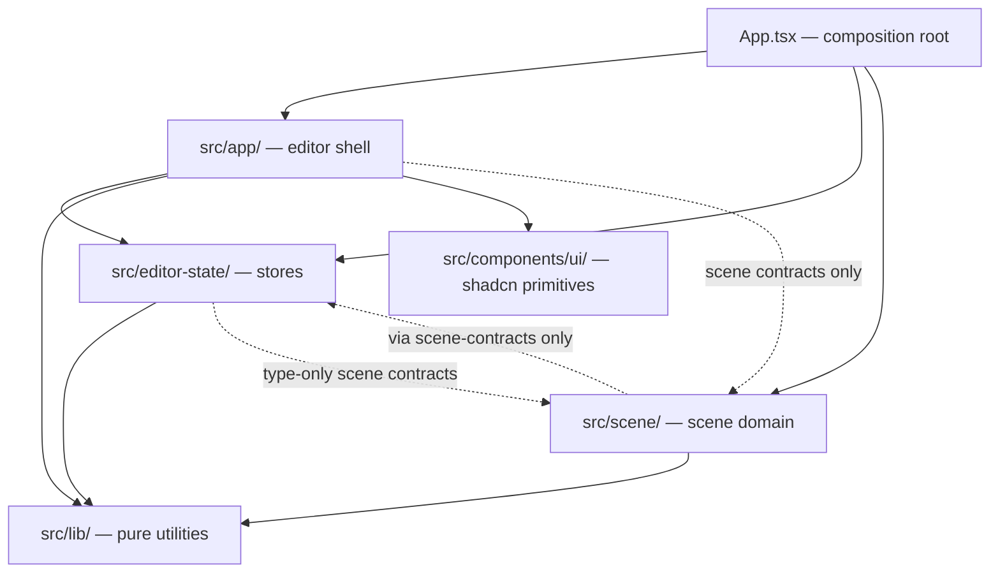

# Architecture Boundaries

## Layer Diagram

## Layer Responsibilities

| Layer                        | Path                           | May import from                                                            | Must not import from                               |
| ---------------------------- | ------------------------------ | -------------------------------------------------------------------------- | -------------------------------------------------- |
| Composition root             | `src/App.tsx`                  | Everything                                                                 | —                                                  |
| Editor shell                 | `src/app/`                     | `editor-state`, `scene` (contracts only), `lib`, `components/ui`           | `scene/internal`                                   |
| Editor state                 | `src/editor-state/`            | `lib`, `scene` (type-only contracts from `scene.types`, `furniture.types`) | `app`, `components`                                |
| Scene domain                 | `src/scene/`                   | `editor-state/scene-contracts`, `lib`                                      | `app`, `components`, direct store modules          |
| Pure views (subset of shell) | Designated files in `src/app/` | `components/ui`, `lib`, type re-exports from `app/*.types.ts`              | `editor-state`, `controllers`, `contexts`, `hooks` |
| Controllers                  | `src/app/controllers/`         | `editor-state`, `scene` (commands/contracts), `lib`, other controllers     | `components/ui`, overlay/view components           |
| UI primitives                | `src/components/ui/`           | `lib`                                                                      | Everything else                                    |
| Utilities                    | `src/lib/`                     | Only `lib` siblings and external packages                                  | `app`, `editor-state`, `scene`, `components`       |

## ESLint Enforcement

All boundaries are enforced via `no-restricted-imports` rules in `eslint.config.js`. The rules are:

1. **Scene isolation** — `src/scene/` cannot import from `src/app/`. Can only import from `@/editor-state/scene-contracts` (all other editor-state paths are blocked).
2. **Editor-state isolation** — `src/editor-state/` cannot import from `src/app/` or `src/components/`.
3. **App-side scene restriction** — `src/app/` cannot import from `@/scene/internal/`.
4. **Controller boundary** — `src/app/controllers/` cannot import UI components (`@/components/`), overlay components, or view components.
5. **Pure-view boundary** — Designated view files cannot import from `@/editor-state/`, `@/app/controllers/`, `@/app/contexts/`, or `@/app/hooks/`.

Test files (`*.test.{ts,tsx}`, `*.spec.{ts,tsx}`) are excluded from these restrictions where needed for test setup flexibility.

## Adding New Modules

### New store

Add to `src/editor-state/`. Export from `src/editor-state/index.ts`. If the scene needs access, add specific exports to `src/editor-state/scene-contracts.ts` and add the new store path to the ESLint block list in the scene restriction (so it remains blocked for direct imports).

### New shared type

- If consumed by stores: put in `src/editor-state/types/`. Export from `src/editor-state/types/index.ts`.
- If consumed only by views/shell: put in `src/app/` as a standalone `.types.ts` file.
- If consumed by both: put in `src/editor-state/types/` and add a re-export shim in `src/app/` (e.g. `src/app/foo.types.ts` re-exports from `@/editor-state/types/foo.types`). Views import from the `src/app/` shim.

### New pure view

Add to the appropriate feature folder in `src/app/`. Add the file path to the pure-view ESLint glob list in `eslint.config.js`. The component must receive all state via props — no store imports, no controller imports, no context imports.

### New controller

Add to `src/app/controllers/`. It automatically inherits the controller boundary rule (no UI component imports). Controllers coordinate state via store actions and scene commands, and return callbacks/data for containers to pass to views.

### New scene internal

Add to `src/scene/internal/`. Never export from scene contract modules (`scene.types.ts`, `scene-commands.ts`, `furniture.types.ts`, `furniture-catalog.ts`).

## Key Conventions

- **Scene contracts** are the stable API between scene and app: `@/scene/scene.types`, `@/scene/scene-commands`, `@/scene/objects/furniture.types`, `@/scene/objects/furniture-catalog`.
- **`@/editor-state/scene-contracts`** is the narrow surface the scene uses to read/write shared state. Keep it minimal.
- **Pure views** are prop-driven components with no knowledge of stores or state management. They compose shadcn primitives from `@/components/ui/` and utilities from `@/lib/`.
- **Connected containers** (e.g. `editor-overlay.tsx`, `top-header.tsx`, `outliner.tsx`, render sites) read from stores and pass state/callbacks to pure views. They are not restricted by the pure-view rule.
- **Type re-export shims** in `src/app/*.types.ts` exist so that pure views can import shared types without touching `@/editor-state/` directly.
