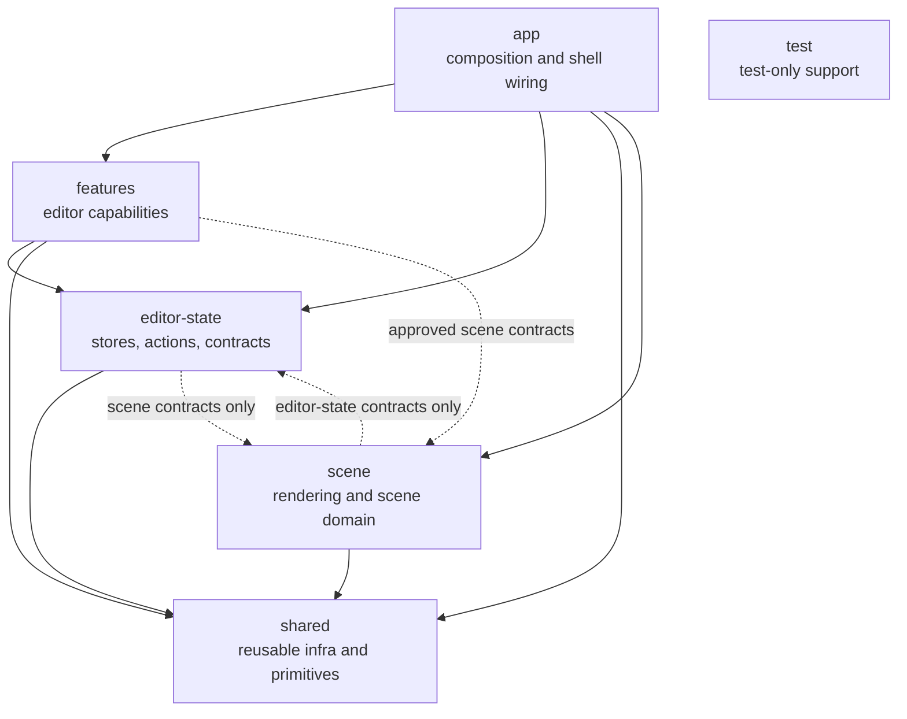

# Architecture Boundaries

This document defines target architecture and placement rules for runtime code.

Architecture boundaries are enforced by ESLint. This document is the policy. `eslint.config.js` is the executable contract.

## Architecture Map

Notes:

- `app` is the composition root and may read across layers.
- `shared/ui` is stricter than other `shared` folders.
- `test` is test-only support and not a runtime dependency target.

## Layer Intent

- `src/app`: composition root, app shell wiring, runtime harness wiring.
- `src/features`: user-facing editor capabilities and feature-local behavior.
- `src/editor-state`: shared stores, actions, selectors, contracts, and shared state types.
- `src/shared`: reusable runtime primitives and infra used by app/features/state/scene.
- `src/scene`: scene rendering domain and scene internals.
- `src/test`: test-only infrastructure.

Keep this document concise and move layer-local detail to the matching
`src/*/README.md` files.

For local context inside each area, see:

- `src/app/README.md`
- `src/features/README.md`
- `src/editor-state/README.md`
- `src/shared/README.md`
- `src/scene/README.md`

## Placement Rules

1. If code is consumed by both `app` and `features`, it cannot live in `app`.
2. Put feature orchestration in a feature folder unless it coordinates multiple features.
3. Put cross-feature state in `editor-state`, not feature-local modules.
4. Keep `shared/ui` dependency-free from app/features/state/scene runtime code.
5. Keep `shared/layout` lower-level than `app/chrome`.
6. Keep scene internals in `scene/internal` and avoid importing them outside scene.
7. Use approved scene contract imports outside scene, not arbitrary `@/scene/**` paths.
8. Do not import `src/test` from runtime code.
9. Keep dialog definition ownership in features (or shell-only app chrome when shell-specific), with app responsible for registry bootstrap composition and editor-state responsible for generic dialog orchestration only.

## Current Exceptions

These are temporary or intentionally narrow.

- Scene runtime imports in app/features/shared are currently allowlisted to a small contract surface.
- `shared/lib` still has a few scene-type dependencies and is not yet fully scene-independent.

## Future Improvements

1. Scene public API surface
   - Replace temporary scene allowlist exceptions with explicit public scene entrypoints.
2. Module public entrypoints
   - Introduce `index.ts` entrypoints for cross-layer modules that are imported externally.
   - Keep purely local modules private.
3. Controller ownership
   - Move feature-specific controllers from app-level orchestration into owning features when boundaries are clear.
4. Feature internal structure
   - Add internal subfolders only where feature size and churn justify it.
5. Shared lib type ownership
   - Reduce `shared/lib` dependency on scene-owned types.
   - Revisit neutral foundational type ownership once scene public surface is finalized.

## Related Docs

- Root overview and scripts: `README.md`
- Agent operating contract and policy routing: `AGENTS.md`, `.agents/README.md`
- Overlay model and behavior: `docs/overlay-interaction-model.md`
- Selected toolbar placement details: `docs/selected-toolbar-placement.md`
- Editor state details: `docs/editor-state-architecture.md`
