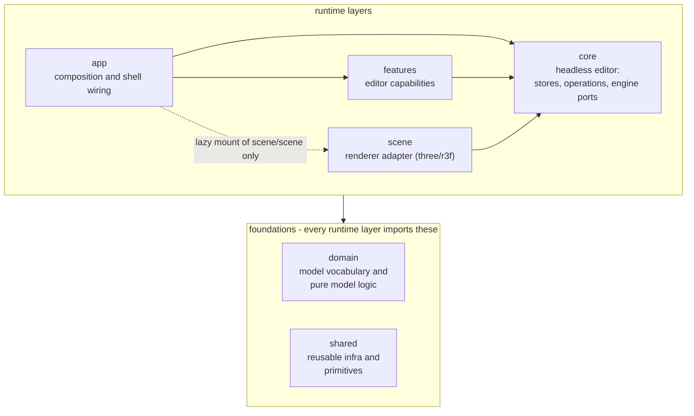

# Architecture

This document defines target architecture and placement rules for runtime code.

Architecture boundaries are enforced by ESLint. This document is the policy. `eslint.config.js` is the executable contract.

## Architecture Map

Every source dependency converges on `core`; nothing depends on `scene` beyond
app's single lazy mount, and nothing depends on a sibling feature. The
foundations are import targets only.

Notes:

- `app` is the composition root and may read across layers.
- **The scene arrow points at core, not the other way.** `core` owns the engine
  port surface (`core/scene-commands`, `core/scene-services`, `core/scene.types`);
  `scene` is the renderer adapter that implements it, registering its viewport
  services on mount and reading/writing core stores directly. At runtime the
  viewport is driven through core's `sceneCommands` port - by core operations
  and feature actions alike - without any source dependency on scene. Nothing
  outside `src/scene` imports `@/scene`; `app`'s single lazy mount of
  `@/scene/scene` is the code-split engine chunk.
- `domain` is the lowest leaf: the furniture/room model types plus pure logic over
  them (catalog lookup, geometry/placement, the scene model). It imports nothing
  internal.
- All of `shared` is uniformly decoupled: it must not import app, features,
  core, scene, or domain (one lint block, no per-subfolder exceptions). The two
  foundations do not import each other.
- `src/test` is test-only support, omitted from the map: runtime code must not
  import it.

## Layer Intent

- `src/app`: composition root, app shell wiring, runtime harness wiring.
- `src/features`: user-facing editor capabilities and feature-local behavior.
- `src/core`: the headless editor - stores, operations, the engine ports, and cross-layer contracts.
- `src/shared`: reusable runtime primitives and infra used by app/features/core/scene; carries no model knowledge.
- `src/scene`: the renderer adapter - scene rendering, input mapping, three helpers, and scene internals.
- `src/domain`: the furniture/room model vocabulary and pure logic over it (catalog, geometry/placement, scene model). The lowest leaf; imports nothing internal.
- `src/test`: test-only infrastructure.

Keep this document concise and move layer-local detail to the matching
`src/*/README.md` files.

For local context inside each area, see:

- `src/app/README.md`
- `src/features/README.md`
- `src/core/README.md`
- `src/shared/README.md`
- `src/scene/README.md`
- `src/domain/README.md`

## Placement Rules

1. If code is consumed by both `app` and `features`, it cannot live in `app`.
2. Put feature-internal orchestration in the owning feature folder. If logic coordinates multiple features, it lives in `core/operations`.
3. Put cross-feature state (`core/stores`) **and** cross-cutting operations (`core/operations`) in `core`, not feature-local modules.
4. Features must not import other features. `@/features/*` imports from within a feature are hard-banned in `eslint.config.js`. De-thread instead by reading a store, dispatching an `EditorCommand`, or importing a `core` operation.
5. Keep `app` composition-only: shell wiring, providers, and registry bootstrap. App does not own cross-cutting runtime operations - those live in `core/operations`.
6. Keep all of `shared` dependency-free from app/features/core/scene/domain runtime code.
7. Keep `shared/layout` lower-level than `app/chrome`.
8. Keep scene internals in `scene/internal` (including `scene/internal/three` render helpers); nothing outside scene may import them.
9. Never import `@/scene` outside app's lazy mount of `@/scene/scene`. Drive the engine through `@/core/scene-commands`; widen the `SceneServices` port deliberately when core needs a new viewport capability.
10. Do not import `src/test` from runtime code.
11. Keep dialog definition ownership in features (or shell-only app chrome when shell-specific), with app responsible for registry bootstrap composition and core responsible for generic dialog orchestration only.
12. Put the model vocabulary and pure logic over it (types, catalog, geometry/placement, the scene model) in `src/domain`. Never reach up into `scene` for model types; `domain` is the shared, dependency-free home every layer imports downward.

> The cross-feature ban (rule 4) is the strict end of a deliberate dial, not a
> law. If a feature ever grows a real public API that a sibling should build on,
> the intended relaxation is per-feature public `index.ts` entrypoints (allow
> importing a sibling's entrypoint, not its internals). It's set strict because a
> ban is cheap to loosen later and costly to impose once sideways imports spread.

## Future Improvements

1. Module public entrypoints
   - Introduce `index.ts` entrypoints for cross-layer modules that are imported externally.
   - Keep purely local modules private.
2. Feature internal structure
   - Add internal subfolders only where feature size and churn justify it.

## Related Docs

- Root overview and scripts: `README.md`
- Agent operating contract and policy routing: `AGENTS.md`, `.agents/README.md`
- Core layer reference: `docs/architecture/core.md`
- The scene/core seam (document ownership and the engine port): `docs/architecture/scene-and-core.md`
- Startup, asset loading, and the bundle split: `docs/architecture/startup-and-asset-loading.md`
- Dialog and overlay model: `docs/architecture/dialogs-and-overlays.md`
- Focus routing between editor surfaces: `docs/architecture/focus.md`
- Interactivity (toolbars, disabled state, inert seam): `docs/architecture/interactivity.md`
- Selected toolbar placement details: `docs/architecture/selected-toolbar-placement.md`
