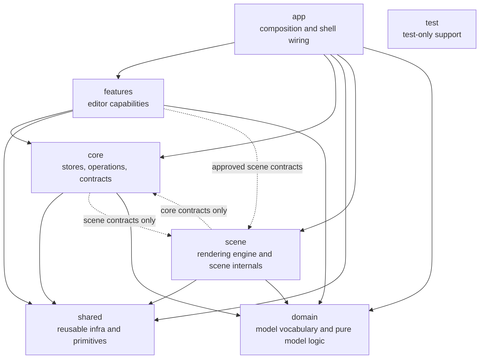

# Architecture

This document defines target architecture and placement rules for runtime code.

Architecture boundaries are enforced by ESLint. This document is the policy. `eslint.config.js` is the executable contract.

## Architecture Map

Notes:

- `app` is the composition root and may read across layers.
- `domain` is the lowest leaf: the furniture/room model types plus pure logic over
  them (catalog lookup, geometry/placement). Every layer may import it; it imports
  nothing internal. `shared` no longer depends on the model at all.
- `shared/ui` is stricter than other `shared` folders.
- `test` is test-only support and not a runtime dependency target.

## Layer Intent

- `src/app`: composition root, app shell wiring, runtime harness wiring.
- `src/features`: user-facing editor capabilities and feature-local behavior.
- `src/core`: shared stores, actions, selectors, contracts, scene-model helpers, and shared state types.
- `src/shared`: reusable runtime primitives and infra used by app/features/core/scene; carries no model knowledge.
- `src/scene`: scene rendering engine, three helpers, and scene internals.
- `src/domain`: the furniture/room model vocabulary and pure logic over it (catalog, geometry/placement). The lowest leaf; imports nothing internal.
- `src/test`: test-only infrastructure.

Keep this document concise and move layer-local detail to the matching
`src/*/README.md` files.

For local context inside each area, see:

- `src/app/README.md`
- `src/features/README.md`
- `src/core/README.md`
- `src/shared/README.md`
- `src/scene/README.md`
- `src/domain/README.md`

## Placement Rules

1. If code is consumed by both `app` and `features`, it cannot live in `app`.
2. Put feature-internal orchestration in the owning feature folder. If logic coordinates multiple features, it lives in `core/operations`.
3. Put cross-feature state (`core/stores`) **and** cross-cutting operations (`core/operations`) in `core`, not feature-local modules.
4. Features must not import other features. `@/features/*` imports from within a feature are hard-banned in `eslint.config.js`. De-thread instead by reading a store, dispatching an `EditorCommand`, or importing a `core` operation.
5. Keep `app` composition-only: shell wiring, providers, and registry bootstrap. App does not own cross-cutting runtime operations — those live in `core/operations`.
6. Keep `shared/ui` dependency-free from app/features/core/scene runtime code.
7. Keep `shared/layout` lower-level than `app/chrome`.
8. Keep scene internals in `scene/internal` (including `scene/internal/three` render helpers) and avoid importing them outside scene.
9. Use approved scene contract imports outside scene, not arbitrary `@/scene/**` paths.
10. Do not import `src/test` from runtime code.
11. Keep dialog definition ownership in features (or shell-only app chrome when shell-specific), with app responsible for registry bootstrap composition and core responsible for generic dialog orchestration only.
12. Put the model vocabulary and pure logic over it (types, catalog, geometry/placement) in `src/domain`. Never reach up into `scene` for model types; `domain` is the shared, dependency-free home every layer imports downward.

> The cross-feature ban (rule 4) is the strict end of a deliberate dial, not a
> law. If a feature ever grows a real public API that a sibling should build on,
> the intended relaxation is per-feature public `index.ts` entrypoints (allow
> importing a sibling's entrypoint, not its internals). It's set strict because a
> ban is cheap to loosen later and costly to impose once sideways imports spread.

## Current Exceptions

These are temporary or intentionally narrow.

- Scene runtime imports in app/features are allowlisted to a small contract surface (`scene-commands`, `scene.types`, and the `furniture-catalog` GLTF runtime). `shared` no longer imports scene at all.

## Future Improvements

1. Scene public API surface
   - Replace temporary scene allowlist exceptions with explicit public scene entrypoints.
2. Module public entrypoints
   - Introduce `index.ts` entrypoints for cross-layer modules that are imported externally.
   - Keep purely local modules private.
3. Operation ownership (largely realized)
   - The former app-level controllers have moved out of `app`: cross-cutting operations now live in `core/operations` and feature-internal orchestration in the owning feature. Convert any remaining app controllers as their seams clarify.
4. Feature internal structure
   - Add internal subfolders only where feature size and churn justify it.
5. Neutral model ownership (realized)
   - The furniture/room model and its pure logic now live in `src/domain`, the dependency-free leaf. `shared` carries no model knowledge. Remaining scene contract allowlisting is the only cross-layer scene surface left to formalize (see item 1).

## Related Docs

- Root overview and scripts: `README.md`
- Agent operating contract and policy routing: `AGENTS.md`, `.agents/README.md`
- Core layer reference: `docs/architecture/core.md`
- Scene⇄core data-model/engine seam: `docs/architecture/scene-and-core.md`
- Dialog and overlay model: `docs/architecture/dialogs-and-overlays.md`
- Selected toolbar placement details: `docs/architecture/selected-toolbar-placement.md`
