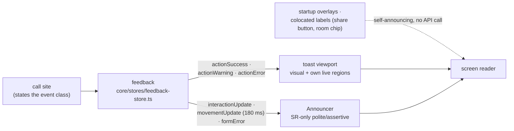

# User Feedback

How the editor tells the user something happened: which surfaces exist, which
event class routes to which surface, and the rules that keep screen-reader
output trustworthy. The API, routing, and both surface backends live in
`core/stores/feedback-store.ts`; this document is normative — the routing
table below, `core/stores/feedback-store.test.ts`, and
`e2e/feedback-routing.spec.ts` must change together.

The one rule behind every surface: reliable announcement needs an
always-present live region, so each feedback class uses the nearest one it
has. Toasts announce through their own always-mounted viewport; SR-only
feedback shares the Announcer pair; startup overlays self-announce via
`role="alert"` insertion; inline field errors render their visible text
conditionally, so their SR interruption borrows the always-mounted assertive
channel.

## Surfaces

**Toasts** (`shared/ui/toast.tsx`, Base UI Toast; the manager singleton lives
in the feedback store). The one home for global transient notices:
visual and screen-reader in a single surface. The viewport is a `role="region"`
landmark labeled "Notifications" with `aria-live="polite"`; high-priority
toasts additionally render into an always-present visually-hidden `role="alert"`
node, which is the assertive path. Key mechanics:

- The viewport portals to `document.body`: the app shell is `position:fixed`,
  which in Chromium establishes a stacking context, so an in-shell viewport
  would paint under the body-portaled drawers/dialogs (`z-50`) no matter its
  own z-index. At body level the viewport's `z-60` wins.
- An `aria-live="off"` wrapper makes the whole toast area survive modal
  aria-hiding (see "Modals and aria-hiding" below).
- Error toasts persist until dismissed (`timeout: 0`); success auto-dismisses
  in 5s, warning in 8s. Stacking limit 3 (oldest evicted). Timers pause while
  the viewport is hovered or focused.
- Keyboard: F6 focuses the viewport (Base UI's own global listener), Tab walks
  into a toast, Escape dismisses the focused toast, and every toast has a
  visible Close button. High-priority toast roots are `aria-hidden` while the
  viewport is unfocused — the `role="alert"` mirror is the SR representation;
  focusing the viewport lifts it.
- The viewport label and close label are Lingui strings (Base UI's defaults
  are hardcoded English).

**Announcer** (`app/chrome/feedback/announcer.tsx`, fed by the feedback
store's announcement channels). SR-only live regions for feedback whose
visual outcome is already on screen. One polite and one assertive `aria-live`
region, both mounted for the app's lifetime (live regions only announce
reliably when they exist before their first message). Each message renders as
a fresh node keyed by a monotonic nonce, so repeating the same text is an
"additions" mutation and re-announces. The polite channel has a debounced
variant (180 ms) for continuous movement; any explicit feedback cancels a
pending debounced message so a stale position never announces after the
outcome that superseded it.

**Inline form errors** (`features/selection/selected-details-view.tsx`). A
rejected field keeps its visible error next to the control: `aria-invalid` on
the input, per-field error text wired through `aria-describedby`, and the
panel's visual support line. The SR interruption goes through the global
announcer's assertive channel (`feedback.formError`) — the panel owns the
visible text, not a live region.

**Startup overlays** (`features/startup/initialization-progress.tsx`,
`initialization-error.tsx`). While startup is loading or errored, the overlays
are the only feedback surface; the feedback API is not used for startup
progress or startup-fatal errors. The progress overlay is `role="status"` with
`aria-live="polite"` and a real progressbar; the error overlay is
`role="alert"` with explicit `aria-live="assertive"` and an autofocused Retry
button — the overlay itself is the announcement, so the error path fires no
toast and no announcer message.

**Colocated control feedback.** In-place operation feedback stays with its
control and is never a toast or an announcer call: the share button's
transient "Shared"/"Copied" label, the room panel's "Updating" `role="status"`
chip, per-tile "Unavailable" states in the catalog. The SR pairing for these
is either the control's own status semantics or an `interactionUpdate`.

## The API

`feedback` (`core/stores/feedback-store.ts`) is the only sanctioned entry
point; call sites state the domain class of the event and never pick
surfaces:

| Entry               | Surfaces                                                                |
| ------------------- | ----------------------------------------------------------------------- |
| `actionSuccess`     | success toast, priority low (viewport announces politely)               |
| `actionWarning`     | warning toast, priority low, 8s                                         |
| `actionError`       | error toast, priority high (assertive), persists until dismissed        |
| `interactionUpdate` | announcer polite, SR-only                                               |
| `movementUpdate`    | announcer polite, 180 ms debounce, SR-only                              |
| `formError`         | announcer assertive, SR-only (visible text is caller-owned)             |
| `reset`             | clears announcer channels + debounce, closes all toasts (startup retry) |

Messages arrive already translated (`i18n._(msg\`...\`)`at the call site).
Toast messages are`{ title, description? }`: the title names the outcome, the
description adds consequence ("Starting with an empty room."). Non-React code
calls the same functions — the toast manager is a module singleton the app
shell passes to `AppToaster`.

The restore flow reaches feedback through an injected adapter
(`RestoreFlowNotifications`) that speaks the same vocabulary
(`actionSuccess/Warning/Error`), keeping the flow testable without module
mocks and unable to pick surfaces ad hoc.

## Routing table (normative)

One event class → one surface set. No event announces on two SR channels.

| Event                                       | Entry point                        |
| ------------------------------------------- | ---------------------------------- |
| Add furniture success                       | `interactionUpdate`                |
| Add furniture failure                       | `actionError`                      |
| Delete success                              | `interactionUpdate`                |
| Delete missing / scene not ready            | `actionError`                      |
| Keyboard move (success and blocked)         | `movementUpdate`                   |
| Rotate success                              | `interactionUpdate`                |
| Rotate blocked mid-drag                     | `movementUpdate`                   |
| Share/copy failure (too large, share, copy) | `actionError`                      |
| Share/copy success                          | `interactionUpdate` + button label |
| Undo / redo complete                        | `interactionUpdate`                |
| Selection changed / cleared                 | `interactionUpdate`                |
| Canvas keyboard browse                      | `interactionUpdate`                |
| Details field committed                     | `interactionUpdate` + inline state |
| Details field invalid                       | inline error + `formError`         |
| Restore success (link or draft)             | `actionSuccess`                    |
| Recovered draft after bad link              | `actionWarning`                    |
| Restore invalid                             | `actionError`                      |
| Start over confirmed                        | `actionSuccess`                    |
| Focus command with no selection             | `interactionUpdate`                |
| Startup progress / startup-fatal error      | overlays only (no API call)        |
| Room finish updating                        | colocated `role="status"` chip     |

## Modals and aria-hiding

Both modal engines in the app — Vaul/Radix drawers (the `aria-hidden` package's
`hideOthers`) and Base UI dialogs (vendored `markOthers`) — apply
`aria-hidden` to background content when a modal opens, and both exempt only
elements matching the literal `[aria-live]` attribute selector, never
descending into an exempt element. Rules that follow:

- Any surface that must stay SR-reachable under an open modal carries an
  explicit `aria-live` attribute; `role="status"`/`role="alert"` alone is not
  exempt. This is why the toast area has its `aria-live="off"` wrapper (Base
  UI's `role="alert"` mirror carries no `aria-live` of its own) and why the
  startup error card sets `aria-live="assertive"` alongside `role="alert"`.
- Toasts remain visible over open drawers/dialogs (body portal, `z-60` over
  `z-50`) and announce through their own regions — an error raised while the
  catalog drawer is open needs no second channel.
- While a modal drawer holds focus, its focus trap wins over F6; a toast can
  be dismissed by pointer, by timeout (non-errors), or by keyboard after the
  modal closes.

## Testing

- `core/stores/feedback-store.test.ts` pins the entry → surface routing and
  the announcer mechanics (nonce re-announce, movement debounce, reset).
- `e2e/feedback-routing.spec.ts` pins the table above in the browser, fired
  surface and silent surfaces both.
- Toast assertions use `e2e/support/toasts.ts` (region landmark + `data-type`);
  announcer assertions use the `data-announcer-channel` helpers in
  `e2e/support/editor-harness.ts`.

### Manual assistive-technology pass

Automation asserts DOM and live-region state, not what a screen reader
actually speaks — timing, interruption, and double-speak are only observable
in a real SR. Run this ~10-minute script (NVDA + Chromium, and VoiceOver +
Safari) whenever feedback surfaces change:

1. Load the editor: no announcement on idle; loading progress announces during
   startup.
2. Add an item: hear "<name> added to room." once — no echo from a second
   surface.
3. Arrow-move the item: position announces roughly once per pause (debounce),
   not per keypress.
4. Go offline (devtools), add an item: the error announces assertively, once;
   F6 reaches the toast; Escape/Close dismisses it and focus returns.
5. Open a `?scene=<garbage>` URL: a single assertive error; no residual
   repeat on later actions.
6. Type `1.2x` into a placement field and press Enter: the error announces,
   focus stays in the field, the error text is discoverable through the
   field's description. Then fix the value and browse the live regions with
   the virtual cursor: the announcer keeps the last message's text (it is a
   transcript of the last announcement, not a state mirror) — judge whether
   stale browse-mode text confuses; if it does, the fix is a clear-after-
   announce timer in the feedback store, not per-consumer clearing.
7. Undo, then Start over: polite/success announcements once each; the success
   toast auto-dismisses without a second announcement.
8. Confirm the announced toast text matches the visible toast text.
