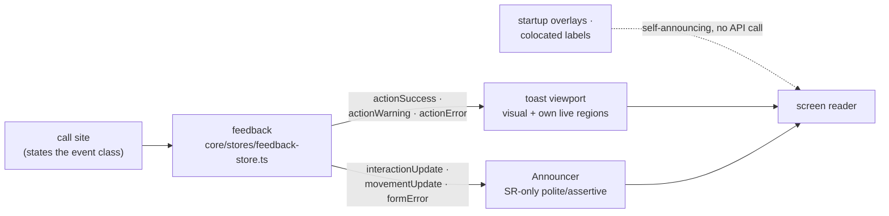

# User Feedback

All user feedback goes through the `feedback` API in
`core/stores/feedback-store.ts`: call sites state the event class, the API
owns which surface fires. Never write to a surface directly.

## Choosing an entry

- **`actionError`** - a user action failed. Persistent error toast, announced
  assertively. Use whenever the user must notice a failure, especially one
  whose only other trace is a missing change (failed add, share/copy failure,
  delete on a stale selection).
- **`actionWarning`** - the outcome is degraded but not lost (a draft
  recovered after a bad share link).
- **`actionSuccess`** - a completed action whose outcome is _not_ already
  visible (restore on load, start over). If the outcome is visible, prefer
  `interactionUpdate`.
- **`interactionUpdate`** - SR-only polite note for outcomes the user can see:
  selection, add/delete, undo/redo, committed edits, focus fallbacks.
- **`movementUpdate`** - `interactionUpdate` debounced for continuous input;
  only the settled state announces.
- **`formError`** - a rejected field input. Assertive announcement; the
  visible error stays with the field (`aria-invalid` + `aria-describedby`).

Not routed through the API:

- Startup loading/error overlays own their phases (`role="status"` /
  `role="alert"`).
- Colocated control feedback stays with its control - the share button's
  "Copied" label, the room panel's "Updating" chip, catalog "Unavailable"
  tiles - usually paired with an `interactionUpdate`.

## Surfaces

One rule connects them: reliable announcement needs an always-present live
region, so each class uses the nearest one it has. Toasts
(`shared/ui/toast.tsx`) are visual + SR in one surface - Base UI's
always-mounted viewport announces them itself (priority high = assertive), so
toast entries never also call the announcer. The Announcer
(`app/chrome/feedback/announcer.tsx`) is the SR-only polite/assertive pair
everything else shares. Startup overlays self-announce on insertion; inline
field errors render their visible text conditionally, so their announcement
borrows the always-mounted assertive channel.

Two behaviors worth knowing before reaching for a surface directly:

- Modal aria-hiding spares only literal `[aria-live]` elements. A surface
  that must stay reachable under an open dialog/drawer carries the attribute
  explicitly - `role="status"`/`role="alert"` alone is not exempt.
- Toasts: errors persist until dismissed, success/warning auto-dismiss, stack
  capped at 3. F6 focuses the viewport, Tab enters a toast, Escape dismisses
  it.

## Testing

`core/stores/feedback-store.test.ts` pins the routing and announcer
mechanics; `e2e/feedback-routing.spec.ts` pins routing in the browser (fired
and silent surfaces both); `e2e/feedback-toasts.spec.ts` covers toast
lifecycle; `e2e/feedback-a11y-audits.spec.ts` runs axe over the feedback
states.

### Manual assistive-technology pass

Automation asserts DOM and live-region state, not what a screen reader
speaks. Run this ~10-minute script with the screen readers available to you
(NVDA/Windows, VoiceOver/macOS, Orca/Linux) whenever feedback surfaces
change:

1. Load the editor: silence on idle; loading progress announces during
   startup.
2. Add an item: "<name> added to room." once, with no echo from a second
   surface.
3. Arrow-move the item: the position announces about once per pause, not per
   keypress.
4. Go offline and add an item: the error announces assertively, once; F6
   reaches the toast; Escape/Close dismisses and focus returns.
5. Open a `?scene=<garbage>` URL: a single assertive error, no repeat on
   later actions.
6. Type `1.2x` into a placement field and press Enter: the error announces,
   focus stays in the field, the error text is reachable through the field's
   description. Then fix the value and browse the live regions with the
   virtual cursor: the announcer keeps the last message's text (a transcript,
   not a state mirror) - judge whether the stale text confuses; if so, the
   fix is a clear-after-announce timer in the feedback store.
7. Undo, then Start over: one announcement each; the success toast
   auto-dismisses without a second announcement.
8. Confirm announced toast text matches the visible toast text.
