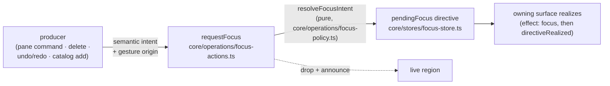

# Focus routing

How keyboard focus moves between the editor's surfaces: the scene (room view),
the item collection (outliner), the inspector (details panel), and the item
actions (selected-item toolbar). Dialog focus capture/restore is separate and
stays local to each dialog — see
[dialogs-and-overlays.md](dialogs-and-overlays.md).

## The pipeline

Producers state _what_ should be focused, never _where_: pane commands name a
surface the user asked for; state changes (delete, undo/redo) say only "focus
the item that now matters". `resolveFocusIntent` — a pure function of the
intent, the gesture origin, the layout, and the post-mutation selection —
turns that into at most one directive for a surface mounted in the current
layout, or drops it. Every cell of the policy table is a unit test in
`focus-policy.test.ts`; that file is the table's one authoritative home.

The gesture origin is declared where the producing site knows it structurally
(the item toolbar is `item-actions`, shortcut literals are `keyboard`) and
otherwise filled from `focusedSurface` — the current-location claim each
surface's own focus/blur handlers maintain (never a focus history). With no
claim, focus on the document body counts as repairable (`unknown`) while focus
on an untracked control counts as `chrome` and is never stolen from.

## Scene vs. item collection

The spatial scene and the item list are distinct intents, not two renderings
of one thing. The resolver picks between surfaces on exactly three grounds —
operation type is never one of them:

- the user named the surface (a pane command);
- the gesture's origin surface (repairs return you where you were working,
  never across surfaces);
- no usable context, on desktop only: the collection is the named landing
  surface.

The resolver picks surfaces; where focus lands _within_ a surface is that
surface's own concern (the outliner's target cascade, the panels' first
control, the scene section itself). That includes within-surface repair: the
outliner refocuses the nearest remaining row when a mutation removes the
focused one, with no resolver involvement.

## Policy principles

- Pointer gestures never move focus — unless the operation destroyed the
  control that held it (delete), in which case focus is always repaired
  rather than left on the body, whatever the modality.
- Keyboard gestures reveal the change within the origin surface; undo/redo
  never jump surfaces.
- Dropping a focus move never drops the operation's live-region announcement.
- On mobile, intents that only the desktop outliner could realize drop (with
  an announcement); repairs land on the scene, the always-mounted surface.

## Lifecycle invariants

A directive is session state that can outlive its moment, so:

- **Supersession**: `requestFocus` mints directives and every resolution
  supersedes — it writes a directive or clears the pending one. The one other
  minter is the desktop toolbar site, which forwards an item-actions
  directive its placement-hidden toolbar cannot realize to the inspector.
  Consumers realize with `directiveRealized(directive)`, which is
  reference-guarded so a late realization cannot drop a newer directive.
- **World changes re-validate**: the pending-focus reconciler clears on
  blocking-overlay open and re-validates on layout flips via
  `directiveSurvivesLayout` — exhaustive over surfaces, so adding a surface
  will not compile until its layout dependence is decided. The startup shell
  reset clears the whole focus store directly. Any new kind of world change
  must clear or re-validate the same way. Known edge: pane shortcuts can mint
  during the brief window before the lazy chrome chunk mounts its realizer;
  the directive realizes late instead of never (bounded by the warm fetch).
- **Deferred realization confirms**: the scene consumer focuses one frame
  late (outliving a closing dialog's own restore), so it re-checks the
  directive is still pending inside the frame and cancels when superseded.
