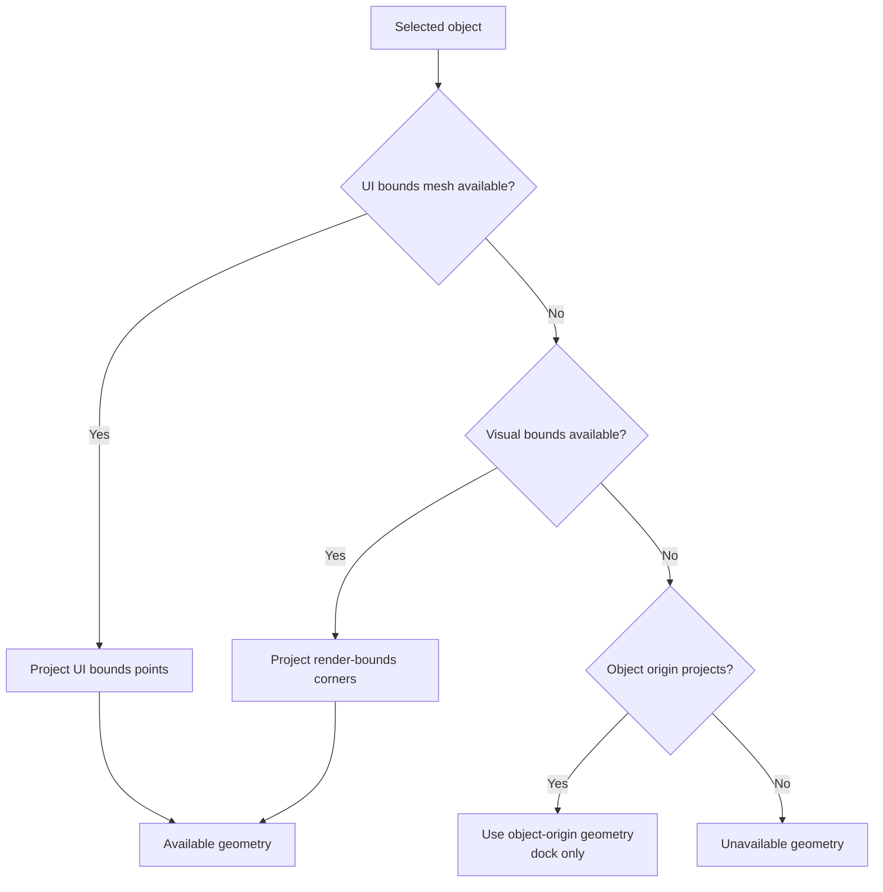
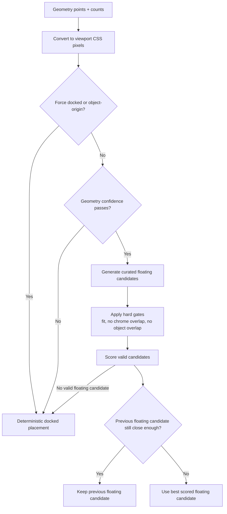

# Selected Toolbar Placement

This document is an overview of how the selected-item action toolbar chooses its geometry source and how it chooses a final screen position. The main code paths are:

- `src/scene/internal/selection/selected-toolbar-geometry.ts`
- `src/scene/scene.types.ts`
- `src/features/selection/use-compute-selected-item-placement.ts`
- `src/features/selection/use-pinned-placement.ts`
- `src/features/selection/use-report-toolbar-engagement.ts`
- `src/core/stores/toolbar-interaction-store.ts`
- `src/features/selection/floating-selected-item-site.tsx`
- `src/features/selection/docked-selected-item-site.tsx`
- `src/features/selection/selected-item-tools.tsx`
- `src/features/selection/selected-details-view.tsx`
- `src/shared/hooks/use-element-rect.ts`
- `src/features/selection/toolbar-placement/selected-toolbar-placement.ts`

## Bounds Selection

Toolbar placement starts with a scene-side geometry selection step. It does not use the footprint geometry that is used for movement collisions and placement. Toolbar placement uses projected UI-facing geometry only.

Current source order:

- `ui-bounds-node`: preferred when the catalog entry provides `uiBoundsNodeName` and the referenced descendant exists in the cloned object subtree
- `render-bounds`: fallback when no UI bounds mesh is available
- `object-origin`: last-resort projected point; this is dock-only because one point is not enough to build a reliable avoidance shape
- unavailable: no selected object, object not ready, or projection failure

`uiBoundsNodeName` provides a preferred toolbar bounds source. It is not an authored point anchor, and it does not bypass overlap checks.

When geometry is available, the scene also publishes:

- `sourcePointCount`: attempted projection input count
- `projectedPointCount`: accepted finite/in-frustum projected points

Those counts exist only to support placement confidence rules around partial projection.

## Placement Strategy

App-side placement converts the scene geometry into viewport CSS pixels and resolves the final toolbar position.

Key rules:

- Scene points start in canvas-local CSS pixels.
- `SelectedItemControls` measures the room-view rect reactively and converts those points into viewport CSS pixels.
- The placement helper works entirely in viewport CSS pixels.
- The current selected-controls wrapper is viewport-aligned, so returned `left` and `top` values can be applied directly with `translate3d(...)`.

Desktop floating placement uses a middle-ground candidate strategy rather than a four-side first-fit policy or a full silhouette search.

The helper:

- builds an axis-aligned screen-space bounds box from the projected points
- rejects geometry that is too sparse, too partial, too tiny, too large, or too far offscreen to trust for floating placement
- generates a small fixed set of nearby candidates such as `top-center`, `top-left`, `right-upper`, and `left-lower`
- inflates the projected object bounds into a soft avoidance rect and also keeps the projected hull for hard object-overlap rejection
- rejects floating candidates that overlap visible chrome or intersect the projected object hull
- applies hard gates for container fit, cross-axis clamp shift, and attachment distance
- scores the remaining candidates using side preference, clamp amount, attachment distance, compactness, and object or chrome clearance, then applies hysteresis via the previous floating candidate id
- falls back to deterministic docked placement when floating is forced off, confidence checks fail, or no floating candidate survives with an acceptable score

Docked placement is best-effort. Floating placement has hard overlap rejection; docked placement still returns the least-bad deterministic slot if the viewport is heavily constrained.

Mobile stays docked by default through the shared header layout mode breakpoint.

## Engagement Pin

While the user is engaging the floating toolbar, its screen position is pinned. The placement engine still recomputes every frame, but the consumer holds the last floating position and renders that instead, so the toolbar does not slide as the selected object re-projects. This keeps the rotate buttons under the cursor when they are pressed repeatedly with pauses — without it, each rotation shifts the object silhouette enough to walk the toolbar out from under a stationary pointer.

- The toolbar is "engaged" while the pointer is over it, focus is within it, or a rotation happened within a short grace window. The grace window is what covers repeated tap-with-pause on the rotate buttons. This is tracked in `toolbar-interaction-store`: `use-report-toolbar-engagement` reports pointer/focus (and resets engagement when the toolbar hides or the selection changes, so it never bleeds onto the next toolbar), and `rotateSelection` reports each rotation (so any input — button, keyboard shortcut — pins).
- The hold lives in `use-pinned-placement` (`resolveHeldPlacement` is a pure freeze rule; `usePinnedPlacement` wraps it) and is applied in `use-compute-selected-item-placement`. On release the live placement flows through again and the float site's CSS transition glides the toolbar to its current spot.
- Only floating placements pin. A new selection or geometry source releases the hold so a stale pinned position can never bleed onto a different object, and a hidden placement (deselection) always wins.

The pin is distinct from hysteresis. Hysteresis is an engine concern that keeps the chosen _side_ stable across frames as scores wobble during camera drift; the pin is a consumer concern that freezes the _position_ while the user is operating the toolbar. Neither changes which candidate the engine selects.

## Practical Notes

- The symmetric no-obstacle path should still land on `top-center`.
- Partial `render-bounds` projection is treated conservatively using `sourcePointCount` and `projectedPointCount`.
- `uiBoundsNodeName` lets assets provide a better projected toolbar shape, but the final placement remains a 2D layout decision.
- Future authored point anchors would be a separate layer on top of this system, not a replacement for bounds selection or overlap rejection.
