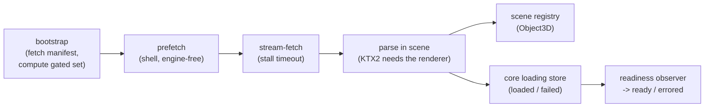

# Startup and Asset Loading

How the app goes from a cold load to an interactive editor, and how furniture
collections stream in. The organizing principle is **environment-first**: the
room, lighting, and camera are interactive within seconds, and furniture models
load independently rather than blocking first paint.

## Bundle split

First paint depends only on a small shell; the heavy 3D engine and the editor
chrome are code-split out and load lazily. Budgets are regression-gated by
`scripts/check-bundle-budget.mjs`.

| Chunk                          | Contents                                                                         | Loads                                         |
| ------------------------------ | -------------------------------------------------------------------------------- | --------------------------------------------- |
| shell (`index-*.js`)           | app skeleton, the loading UI, the engine-free asset prefetch, placement geometry | eagerly (first paint)                         |
| engine (`scene-canvas-*.js`)   | three / r3f / drei / postprocessing                                              | lazily, in parallel with the shell's prefetch |
| chrome (`editor-overlay-*.js`) | editor panels, toolbars, icon deps                                               | lazily, once the editor is interactive        |

Two consequences worth knowing:

- **The asset prefetch is deliberately engine-free** (`core/operations/furniture-asset-prefetch.ts`
  deals only in `ArrayBuffer`s, no three import). Because it ships in the shell, a
  restored scene's furniture bytes download _in parallel_ with the larger engine
  chunk instead of waiting for it.
- **`index.html` renders an `#app-skeleton` loader that mirrors the React loader**
  (`InitializationProgress`) element-for-element, so the handoff from static HTML
  to the mounted app has no layout shift.

## Startup phases

`core/stores/editor-lifecycle-store.ts` holds `startupPhase: 'loading' | 'ready' | 'errored'`:

- `loading` - the opaque loader overlay covers the (already-mounting) canvas; editor
  interactions are disabled.
- `ready` - overlay gone, editor interactive.
- `errored` - the startup error overlay with a retry.

Two supporting signals:

- `sceneEpoch` / `retryToken` bump on load/retry and re-key the scene subtree, so a
  retry remounts a fresh scene and loader.
- `sceneMounted` - a reactive flag the `Scene` sets on mount/unmount (through
  `scene-contracts`). Readiness gates on it so the overlay never lifts before the
  canvas has mounted (an empty scene has no furniture to wait on, so without this
  the overlay could clear before first paint).

## The loading pipeline

- **Bootstrap** (`features/startup/use-startup-bootstrap.ts`): fetches and validates
  the catalog manifest into `assets-store`, resolves the **gated set** - the
  collections the restored URL/draft actually references
  (`core/persistence/referenced-collections.ts`) - into the loading store, and
  starts the prefetch. The gated set is `null` until resolved (and again after a
  retry resets it), so readiness can never complete against a stale or unknown
  gate.
- **Stream-fetch** (`core/operations/stream-fetch.ts`): a streaming fetch with a
  _stall_ timeout (aborts if no bytes arrive for ~15s, rather than a total-duration
  cap, so slow connections are not failed) that reports byte progress and throws
  `AssetHttpError` on a non-ok response.
- **Parse** (`scene/internal/furniture/use-collection-loader.ts`): runs inside the
  Canvas because configuring the KTX2/Basis transcoder needs the live
  `WebGLRenderer`. It parses bytes to an `Object3D`, registers it in the scene-side
  `collection-scene-registry`, and reports the outcome (loaded / failed) to the core
  `collection-loading-store`.
- **Readiness** (`features/startup/use-startup-readiness.ts`, run from `App`): once
  startup is loading, the scene has mounted, and the manifest is present, it resolves
  the gated collections - every one loaded -> `completeAssetLoad`; any one failed ->
  `notifyAssetError`. It fires once per cycle because firing flips the phase off
  `loading`.

The split of state is intentional: the parsed `Object3D`s are a scene render
artifact (`collection-scene-registry`, scene-internal), while the three-free
loading lifecycle - progress, which collections are wanted, loaded, or failed -
lives in `core/stores/collection-loading-store.ts` next to the prefetch and gating
it coordinates with. The loader is the bridge, reporting outcomes up to core via
`scene-contracts`.

## Gated vs on-demand

- **Gated** collections gate the unlock. A fresh or empty scene references none, so
  it becomes interactive as soon as the scene mounts and the manifest is present -
  it never waits on furniture.
- **On-demand** collections are catalog adds. Selecting an item warms it
  (prefetch-on-select) and the add awaits its parse (`ensureCollectionLoaded`), so a
  not-yet-loaded model resolves before it is placed rather than popping in. The
  wanted set lives in the loading store and keeps an added item's collection
  available for the session.

Both paths run through the same loader; `scene-canvas`'s `resolveBytes` chooses the
byte source (the prefetched buffer for gated paths, a direct stream for on-demand).

## Failure model

Failures are classified (`collection-loading-store.ts`) as:

- **`unavailable`** - a non-ok HTTP response (`AssetHttpError`) or a
  post-download failure such as a GLB parse error: the model is missing or
  broken. Permanent; never auto-retried.
- **`connection`** - a network error or stall abort. Transient; a re-request retries.

How each surfaces:

| Failure                                         | Surface                                            | Recovery                           |
| ----------------------------------------------- | -------------------------------------------------- | ---------------------------------- |
| Manifest fetch fails                            | startup error overlay                              | retry                              |
| A **gated** collection fails                    | startup error overlay                              | retry (re-downloads)               |
| An **on-demand** add fails                      | toast (the open drawer aria-hides the status line) | re-add retries a transient failure |
| A permanently `unavailable` catalog item        | shown non-selectable in the catalog                | -                                  |
| A loaded GLB missing a manifest-referenced node | startup error (via the scene error boundary)       | fix the asset/manifest             |

The add flow never hangs: `ensureCollectionLoaded` rejects on failure so the drawer
can message by cause instead of waiting forever.

## Retry

`requestAssetRetry` (`core/operations/startup-coordinator.ts`) resets the core
loading lifecycle and the scene registry, clears the prefetch buffers, and bumps the
epoch so a fresh loader remounts and re-downloads. Reset happens **only** on an
explicit retry - on the error path a gated failure's mark survives, so the loader
does not immediately re-attempt and loop.

## Pointers

- Phases / signals: `core/stores/editor-lifecycle-store.ts`
- Gating: `core/persistence/referenced-collections.ts`
- Fetch: `core/operations/stream-fetch.ts`, `core/operations/furniture-asset-prefetch.ts`
- Loading state: `core/stores/collection-loading-store.ts`
- Parse / registry: `scene/internal/furniture/use-collection-loader.ts`, `collection-scene-registry.ts`
- Orchestration: `features/startup/use-startup-bootstrap.ts`, `use-startup-readiness.ts`, `core/operations/startup-coordinator.ts`
- Bundle budgets: `scripts/check-bundle-budget.mjs`

## Related docs

- `docs/architecture/architecture.md`
- `docs/architecture/scene-and-core.md`
- `docs/architecture/catalog-and-assets.md`
- `docs/reference/catalog-manifest-schema.md`
