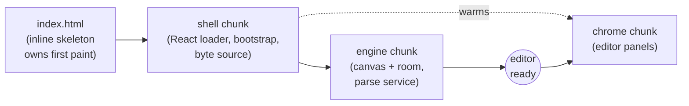
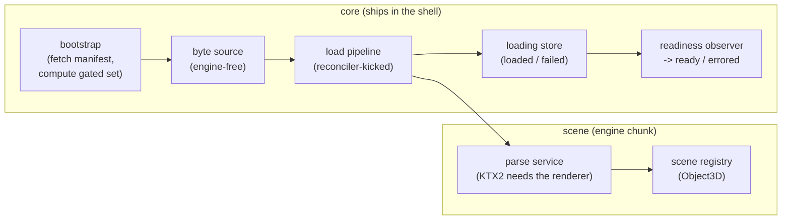

# Startup and Asset Loading

How the app goes from a cold load to an interactive editor, and how furniture
collections stream in. The organizing principle is **environment-first**: the
room, lighting, and camera are interactive within seconds, and furniture models
load independently rather than blocking first paint.

Two load stories run in parallel and meet at startup readiness:

- **The app load** - the page and its code chunks, and which UI owns the screen
  at each stage.
- **The collection load pipeline** - how furniture GLBs download, parse, and
  become renderable.

## The app load

Readiness also waits on the gated furniture collections, which download in
parallel with the engine chunk - that story is the
[collection load pipeline](#the-collection-load-pipeline) below.

What the user sees, in order:

1. **The static skeleton** - inline in `index.html`, on screen before any
   JavaScript arrives.
2. **The React loader** (`InitializationProgress`) - replaces the skeleton in
   place. The two mirror each other element-for-element (column geometry, theme
   colors), so the handoff has no layout shift or flash.
3. **The editor** - at ready the loader lifts to the already-mounted room and
   the chrome mounts from its chunk (warmed during loading, so it is usually
   cached by then). A startup failure replaces this step with the error
   overlay and its retry.

The chunks, whose gzip sizes are regression-gated by
`scripts/check-bundle-budget.mjs`:

| Chunk                                | Contents                                                                                    |
| ------------------------------------ | ------------------------------------------------------------------------------------------- |
| shell (`index-*.js`)                 | app skeleton, loading/error UI, bootstrap + the engine-free byte source, placement geometry |
| engine (`scene-canvas-*.js`, lazy)   | three / r3f / drei / postprocessing; the canvas, room, and collection parse service         |
| chrome (`editor-overlay-*.js`, lazy) | editor panels, toolbars, icon deps                                                          |

One consequence worth calling out: **the collection byte source is deliberately
engine-free** (`core/operations/collection-bytes.ts` deals only in
`ArrayBuffer`s, no three import). Because it ships in the shell, a restored
scene's furniture bytes download _in parallel_ with the larger engine chunk
instead of waiting for it.

## Startup phases

`core/stores/editor-lifecycle-store.ts` holds `startupPhase: 'loading' | 'ready' | 'errored'`:

- `loading` - the opaque loader overlay covers the (already-mounting) canvas; editor
  interactions are disabled.
- `ready` - overlay gone, editor interactive.
- `errored` - the startup error overlay with a retry.

Two supporting signals:

- `startupCycle` bumps **only** in `requestRetry` - only on an explicit user
  retry - and its three consumers rely on exactly that invariant: the
  scene-canvas key (one Scene remount per retry), the collection loader's
  stale-cycle guard, and `startup-chunk-retry` (a bump is "the next explicit
  retry"). The manifest arriving does not bump it: the mounted Scene picks the
  manifest up through props.
- `sceneReady` - a reactive flag with a single producer:
  `registerSceneServices`/`clearSceneServices` (`core/scene-services.ts`) flip it
  as the `Scene` registers on mount and clears on unmount (the startup-shell
  reset also clears it), so the flag and the imperative
  `sceneCommands.isSceneReady()` answer from the same oracle. Readiness gates on
  it so the overlay never lifts before the canvas has mounted (an empty scene
  has no furniture to wait on, so without this the overlay could clear before
  first paint).

## The collection load pipeline

The pipeline spans the core/scene boundary: everything except the parse lives in
core (and ships in the shell); the scene contributes exactly one capability,
parse-and-register, because configuring the KTX2 transcoder needs the live
renderer.

- **Bootstrap** (`core/operations/startup-bootstrap.ts`, invoked at app mount
  by the thin `features/startup/use-startup-bootstrap.ts` hook and directly by
  `requestAssetRetry`; latest wins, a superseded or cancelled run writes
  nothing): fetches and validates
  the catalog manifest into `assets-store`, resolves the **gated set** - the
  collections the restored URL/draft may reference
  (`core/operations/referenced-collections.ts`, read-only over the restore
  flow's own `selectPrimaryRestoreState`, so gate and restore share one
  precedence rule; a valid draft stays gated alongside a valid link because it
  remains the apply-failure fallback) - into the loading store, and warms the
  byte source for it. The gated set is `null` until resolved (and again
  after a retry resets it), so readiness can never complete against a stale or
  unknown gate.
- **Byte source** (`core/operations/collection-bytes.ts`): one fetch per
  collection per cycle, shared by every consumer - bootstrap warms the gated set,
  on-demand paths start on first request. Buffers are released once parsed (the
  registry's parsed scene supersedes them); a failed fetch forgets its entry so a
  re-request retries.
- **Stream-fetch** (`core/operations/stream-fetch.ts`): a streaming fetch with a
  _stall_ timeout (aborts if no bytes arrive for ~15s, rather than a total-duration
  cap, so slow connections are not failed) that reports byte progress and throws
  `AssetHttpError` on a non-ok response.
- **Load pipeline** (`core/operations/collection-loader.ts`): core drives each
  load end-to-end - fetch the bytes, have the scene parse, validate (every
  catalog entry of the collection must resolve its manifest-referenced nodes),
  and register them (`sceneCommands.loadCollectionScene`, backed by
  `scene/internal/furniture/collection-scene-loader.ts`), then mark the outcome
  in the loading store. A standing reconciler kicks pending loads whenever their
  inputs change (scene becomes ready, gate resolves, an item appears, an
  on-demand request arrives), so the chain never depends on React render timing. Loads are
  keyed to the startup cycle; a stale cycle's result is discarded rather than
  written into a fresh one.
- **Readiness** (`features/startup/use-startup-readiness.ts`, run from `App`): once
  startup is loading, the scene is ready, and the gated set is resolved, it
  resolves the gated collections - every one loaded -> `completeAssetLoad`; any
  one failed -> `notifyAssetError`. It fires once per cycle because firing flips
  the phase off `loading`.

The split of state is intentional: the parsed scene roots live in
`core/stores/collection-scene-registry.ts`, held opaquely (`unknown`, so core
stays three-free); typed `Object3D` access lives scene-internal in
`scene/internal/furniture/collection-scene-registry.ts`, while the loading
lifecycle - the gate, progress, which collections are wanted, loaded, or
failed - lives in `core/stores/collection-loading-store.ts` next to the byte
source and gating it coordinates with. Registration happens inside the parse
service, before core marks the collection loaded, so consumers may read the
registry on the strength of the core flag.

## Gated vs on-demand

- **Gated** collections gate the unlock. A fresh or empty scene references none,
  so it becomes interactive as soon as the scene is ready and the gate resolves -
  it never waits on furniture.
- **On-demand** collections are catalog adds. Selecting an item warms it
  (prefetch-on-select) and the add awaits its parse (`ensureCollectionLoaded`), so a
  not-yet-loaded model resolves before it is placed rather than popping in. The
  wanted set lives in the loading store and keeps an added item's collection
  available for the session.

Both paths run through the same pipeline and the same byte source; the only
difference is when the download starts (bootstrap warms the gated set, an
on-demand path starts on first request).

## Failure model

Failures are classified (`collection-loading-store.ts`) as:

- **`unavailable`** - a non-ok HTTP response (`AssetHttpError`) or a
  post-download failure such as a GLB parse error: the model is missing or
  broken. Permanent; never auto-retried.
- **`connection`** - a network error or stall abort. Transient; a re-request retries.

How each surfaces:

| Failure                                  | Surface                                           | Recovery                           |
| ---------------------------------------- | ------------------------------------------------- | ---------------------------------- |
| Manifest fetch fails                     | startup error overlay                             | retry                              |
| An engine/chrome chunk fails to load     | startup error overlay                             | retry (reloads for a fresh graph)  |
| A **gated** collection fails             | startup error overlay                             | retry (re-downloads)               |
| An **on-demand** add fails               | toast + assertive announcement                    | re-add retries a transient failure |
| A permanently `unavailable` catalog item | shown non-selectable in the catalog               | -                                  |
| A GLB missing a manifest-referenced node | gated: startup error; on-demand: unavailable tile | fix the asset/manifest             |

The add flow never hangs: `ensureCollectionLoaded` rejects on failure so the drawer
can message by cause instead of waiting forever.

## Retry

`requestAssetRetry` (`core/operations/startup-coordinator.ts`) resets the core
loading lifecycle and the scene registry, clears the byte source, bumps the
startup cycle so the remounting Scene re-kicks the loads and re-downloads, and
re-runs the bootstrap fetch; a load still in flight from the stale cycle
discards its result. Reset happens **only** on an explicit retry - on the error
path a gated failure's mark survives, so the pipeline does not immediately
re-attempt and loop.

Two special cases:

- A failed **app chunk** fetch (`app/chrome/startup-chunk-retry.ts`) turns the
  retry into a full page reload: the browser may cache the failed module fetch,
  and after a stale deploy only re-reading `index.html` picks up the fresh
  chunk graph. An errored phase is sticky against a late manifest success
  (`beginAssetLoad` no-ops on `errored`), so a chunk failure that races the
  manifest fetch keeps the error overlay up until that retry.
- An add failure while the drawer is open reports on two channels: a toast for
  visual users, and an assertive announcement - the toast region is a polite
  live region only, and an error in response to a user action should
  interrupt. Both survive the drawer's aria-hiding, which exempts `aria-live`
  regions.

## Pointers

- Phases / signals: `core/stores/editor-lifecycle-store.ts`
- Gating: `core/operations/referenced-collections.ts`
- Fetch: `core/operations/stream-fetch.ts`, `core/operations/collection-bytes.ts`
- Loading state: `core/stores/collection-loading-store.ts`
- Load pipeline: `core/operations/collection-loader.ts`
- Parse / registry: `scene/internal/furniture/collection-scene-loader.ts`; state in `core/stores/collection-scene-registry.ts` (typed scene access in `scene/internal/furniture/collection-scene-registry.ts`)
- Orchestration: `core/operations/startup-bootstrap.ts`, `core/operations/startup-coordinator.ts`, `features/startup/use-startup-readiness.ts`
- Chunk-failure recovery: `app/chrome/startup-chunk-retry.ts`
- Bundle budgets: `scripts/check-bundle-budget.mjs`

## Related docs

- `docs/architecture/architecture.md`
- `docs/architecture/scene-and-core.md`
- `docs/architecture/catalog-and-assets.md`
- `docs/reference/catalog-manifest-schema.md`
