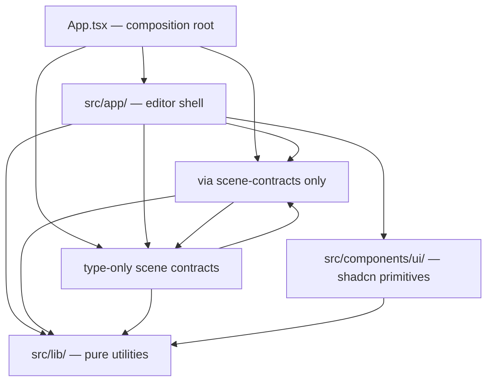

# Architecture Refactor — Phase 4 Plan

## Goal

Formalize package-style boundaries (Item F from the outline). After Phases 1–3, the natural layers exist — stores are in `src/editor-state/`, controllers in `src/app/controllers/`, contexts in `src/app/contexts/`, view-layer components alongside their feature folders, and the scene is isolated. This phase makes those boundaries real and enforceable: re-home modules that landed in the wrong layer, extract shared types that cross layers into a neutral location, and add ESLint import restrictions so future changes cannot re-introduce coupling.

## Current state (ground truth)

### Directory structure as-built

```
src/
├── App.tsx                          # Composition root
├── editor-state/                    # Zustand stores (4 stores + index barrel)
│   ├── dialog-store.ts
│   ├── editor-runtime-store.ts
│   ├── scene-state-store.ts
│   ├── selection-meta-store.ts
│   ├── store-types.ts
│   └── index.ts
├── scene/                           # Scene domain (already boundary-enforced)
│   ├── scene.tsx
│   ├── scene.types.ts
│   ├── scene-commands.ts
│   ├── objects/
│   │   ├── furniture.types.ts
│   │   └── furniture-catalog.ts
│   └── internal/                    # Off-limits to app-side code
├── app/                             # Editor shell (controllers, overlay, features)
│   ├── controllers/                 # Phase 2 controllers
│   │   ├── _shared/
│   │   │   ├── constants.ts
│   │   │   ├── format-messages.ts
│   │   │   ├── restore-flow.ts
│   │   │   ├── types.ts
│   │   │   └── use-active-finish-ids.ts
│   │   ├── use-asset-lifecycle-controller.ts
│   │   ├── use-canvas-keyboard-controller.ts
│   │   ├── use-catalog-controller.ts
│   │   ├── use-deletion-controller.ts
│   │   ├── use-history-controller.ts
│   │   ├── use-movement-controller.ts
│   │   ├── use-scene-selection-effects.ts
│   │   ├── use-selection-controller.ts
│   │   ├── use-share-controller.ts
│   │   └── use-start-over-controller.ts
│   ├── contexts/
│   │   ├── editor-refs-context.tsx
│   │   └── overlay-layout-context.tsx
│   ├── selection/                   # Phase 3 selected-item decomposition
│   │   ├── selected-actions-view.tsx         (pure view)
│   │   ├── selected-details-view.tsx         (pure view)
│   │   ├── selection-tools-other.tsx         (pure view)
│   │   ├── floating-selected-item-site.tsx   (render site — reads stores)
│   │   ├── docked-selected-item-site.tsx     (render site — reads stores)
│   │   ├── selected-item-interaction-context.tsx
│   │   ├── use-selected-item-placement-context.tsx
│   │   ├── use-compute-selected-item-placement.ts
│   │   ├── selected-item-placement.types.ts
│   │   ├── delete-confirmation-dialog.tsx
│   │   └── start-over-confirmation-dialog.tsx
│   ├── overlay/                     # Header, sidebar, room surface, layout
│   │   ├── editor-overlay.tsx
│   │   ├── top-header.tsx           (connected — reads many stores)
│   │   ├── top-header-desktop.tsx   (pure props)
│   │   ├── top-header-mobile.tsx    (pure props)
│   │   ├── top-header.types.ts
│   │   ├── room-controls.tsx
│   │   ├── room-drawer.tsx
│   │   ├── room-sidebar.tsx
│   │   ├── room-surface-content.tsx
│   │   ├── header-more-actions-drawer.tsx
│   │   ├── share-scene-button.tsx
│   │   ├── start-over-button.tsx
│   │   ├── status-message.tsx
│   │   ├── use-header-layout-mode.ts
│   │   ├── use-overlay-exclusion-rects.ts
│   │   └── focusable-controls.ts
│   ├── camera/
│   │   └── camera-tools.tsx         (has both pure CameraTools & ConnectedCameraTools)
│   ├── history/
│   │   ├── history-tools.tsx        (pure view — all props)
│   │   └── history.types.ts
│   ├── keyboard/
│   │   ├── keyboard-shortcuts-help.tsx
│   │   ├── keyboard-shortcuts.definitions.ts
│   │   ├── use-camera-key-state.ts
│   │   └── use-keyboard-shortcuts.ts
│   ├── catalog/
│   │   ├── catalog-add-button.tsx
│   │   └── catalog-drawer.tsx
│   ├── scene-panel/
│   │   ├── announcer.tsx            (pure view — prop-driven)
│   │   └── outliner.tsx             (connected — reads stores directly)
│   ├── startup/
│   │   ├── catalog-manifest.ts
│   │   ├── initialization-error.tsx
│   │   ├── initialization-progress.tsx
│   │   ├── perf-log.ts
│   │   ├── reset-startup-state.ts
│   │   ├── scene-defaults.ts
│   │   ├── startup-transitions.ts
│   │   └── use-startup-state.ts
│   ├── project-info/
│   │   ├── asset-attribution.tsx
│   │   ├── asset-attributions.json
│   │   ├── project-info-button.tsx
│   │   └── project-info-dialog.tsx
│   ├── url-scene/
│   │   ├── scene-draft.ts
│   │   └── scene-url.ts
│   ├── hooks/
│   │   ├── command-messages.ts
│   │   ├── use-announcements.ts
│   │   ├── use-element-rect.ts
│   │   └── use-element-size.ts
│   ├── scene-interaction.types.ts
│   ├── scene-panel.types.ts
│   ├── selected-item-details.types.ts
│   ├── use-draft-persistence.ts
│   ├── use-preview-controller.ts
│   └── use-test-state-bridge.ts
├── components/ui/                   # shadcn primitives (no app logic)
├── lib/
│   ├── three/                       # Pure math/Three.js helpers
│   ├── ui/                          # Framework-agnostic UI utilities
│   ├── debug/
│   ├── utils.ts
│   ├── asset-path.ts
│   └── furniture-serialization.ts
└── test/                            # Test utilities (RTTR helpers, setup)
```

### Cross-layer import violations that exist today

These are imports that violate the target boundaries defined in Item F:

1. **`editor-state` → `app`** (stores import app-side types):
   - `editor-runtime-store.ts` imports `type StartupErrorKind` from `@/app/startup/use-startup-state`
   - `scene-state-store.ts` imports `type HistoryAvailability` from `@/app/history/history.types`
   - `selection-meta-store.ts` imports `type InteractionSource` from `@/app/scene-interaction.types`
   - `selection-meta-store.ts` imports `type SceneOutlinerFocusRequest` from `@/app/scene-panel.types`

2. **"Pure view" components that read stores directly** (would violate `editor-ui` isolation):
   - `outliner.tsx` reads from all 4 stores
   - `camera-tools.tsx` `ConnectedCameraTools` reads `editor-runtime-store` and `scene-state-store`
   - `status-message.tsx` reads `scene-state-store`
   - `top-header.tsx` reads from all 4 stores (but this is a _connected container_, not a pure view — it passes props to the pure `TopHeaderDesktop`/`TopHeaderMobile`)

3. **No current ESLint rule prevents** `editor-state` from importing `app` or `components`.

### What already aligns with Item F targets

- Scene isolation is enforced (ESLint blocks `scene → app` imports).
- App-side code cannot import scene internals (ESLint pattern on `@/scene/internal`).
- `editor-state/` already exists as a standalone directory.
- Controllers are consolidated under `app/controllers/`.
- Contexts are consolidated under `app/contexts/`.
- `selected-actions-view.tsx`, `selected-details-view.tsx`, `selection-tools-other.tsx`, `history-tools.tsx`, `top-header-desktop.tsx`, `top-header-mobile.tsx`, `announcer.tsx`, `initialization-error.tsx`, `initialization-progress.tsx`, `delete-confirmation-dialog.tsx`, `start-over-confirmation-dialog.tsx` are already pure/prop-driven views.

---

## Scope

This phase is **pure rearrangement and rule enforcement**. No behavior changes, no API changes, no visual changes. Every relocated module keeps its existing export surface.

The two deliverables:

1. **Move/extract files** so each layer has a clean import graph.
2. **Add ESLint `no-restricted-imports` rules** that enforce the new boundaries permanently.

---

## Sub-items

### 4A — Extract shared types to `src/editor-state/types/`

Types that are consumed by `editor-state` stores AND by `app/` components today live in `app/` simply because that's where they were born. They need to move to a neutral location that both layers can import from. The stores themselves are the primary consumer, so `src/editor-state/types/` is the most natural home.

**Files to create** (by moving and re-exporting):

| New file                                        | Source type                                                                                    | Current location                                 |
| ----------------------------------------------- | ---------------------------------------------------------------------------------------------- | ------------------------------------------------ |
| `src/editor-state/types/startup.types.ts`       | `StartupErrorKind`                                                                             | `src/app/startup/use-startup-state.ts` (line 27) |
| `src/editor-state/types/history.types.ts`       | `HistoryAvailability`                                                                          | `src/app/history/history.types.ts`               |
| `src/editor-state/types/interaction.types.ts`   | `InteractionSource`, `PanelInteractionSource`, `PanelSelectById`                               | `src/app/scene-interaction.types.ts`             |
| `src/editor-state/types/scene-panel.types.ts`   | `SceneOutlinerFocusRequest`, `ScenePanelReadModel`                                             | `src/app/scene-panel.types.ts`                   |
| `src/editor-state/types/selected-item.types.ts` | `SelectedItemDetailField`, `UpdateSelectedItemDetailsInput`, `UpdateSelectedItemDetailsResult` | `src/app/selected-item-details.types.ts`         |

**Migration steps for each type file:**

1. Create the new file in `src/editor-state/types/` with the type definitions.
2. Change the old file in `src/app/` to re-export from the new location:
   ```ts
   // src/app/scene-interaction.types.ts
   export type {
     InteractionSource,
     PanelInteractionSource,
     PanelSelectById,
   } from '@/editor-state/types/interaction.types'
   ```
3. Update imports in `src/editor-state/*.ts` store files to point to `./types/...` (internal relative imports).
4. Leave all `src/app/` consumers importing from the old `@/app/...` path until 4B (they work via re-export).
5. After 4B stabilizes, optionally bulk-update `app/` consumers to import from `@/editor-state/types/...` directly and delete the re-export shim files. This is optional cleanup — the re-exports are harmless.

**Barrel export:** Add `src/editor-state/types/index.ts` that re-exports all type files. Update `src/editor-state/index.ts` to include `export * from './types'`.

**Validation:** `pnpm typecheck && pnpm lint && pnpm test:run` must pass with no changes to behavior.

---

### 4B — Enforce `editor-state` import boundary via ESLint

Add a new ESLint config block restricting what `src/editor-state/` may import:

```js
// eslint.config.js — new block
{
  files: ['src/editor-state/**/*.{ts,tsx}'],
  rules: {
    'no-restricted-imports': [
      'error',
      {
        patterns: [
          {
            group: ['@/app', '@/app/**'],
            message:
              'src/editor-state must not import from src/app. Move shared types to src/editor-state/types/.',
          },
          {
            group: ['@/components', '@/components/**'],
            message:
              'src/editor-state must not import React UI components.',
          },
          {
            group: ['react', 'react-dom'],
            allowTypeImports: true,
            message:
              'src/editor-state should not import React runtime modules. Use zustand/vanilla for store creation and export hook wrappers only.',
          },
        ],
      },
    ],
  },
},
```

**Adjustment for React:** The stores currently use `useStoreWithEqualityFn` from `zustand/traditional` and `useCallback`/`useMemo` from React in the `dialog-store.ts` `useDialogStateSnapshot` hook. This is acceptable — the rule targets `react` as a runtime-only import (components), but type imports and zustand's own React bindings are fine. The react restriction uses `allowTypeImports: true`, so type-only imports pass. The `zustand/traditional` import is not from `react` — it passes. If `dialog-store.ts` uses `useCallback`/`useMemo` from `react`, that import will flag. Resolution: move `useDialogStateSnapshot` (which is a React hook, not a store primitive) out of `editor-state` into `src/app/hooks/use-dialog-state-snapshot.ts`, or — if we prefer keeping it co-located — make the react restriction a warning rather than an error. **Decision: move `useDialogStateSnapshot` to `src/app/hooks/use-dialog-state-snapshot.ts`.** It is the only React hook in the store files; all other store files use only zustand/vanilla + zustand/traditional (which internally depends on React but is not an import from 'react' in our code).

**Specifics for `useDialogStateSnapshot`:**

1. Inspect `src/editor-state/dialog-store.ts` for `import { useCallback, useMemo } from 'react'` — confirm this is used only by `useDialogStateSnapshot`.
2. Extract `useDialogStateSnapshot` (and its supporting type `DialogStateSnapshot`) into `src/app/hooks/use-dialog-state-snapshot.ts`.
3. The new file imports from `@/editor-state/dialog-store` for the raw selectors it composes.
4. Update all consumers that import `useDialogStateSnapshot` or `DialogStateSnapshot` from `@/editor-state/dialog-store` to import from `@/app/hooks/use-dialog-state-snapshot` instead.
5. Remove the `react` import from `dialog-store.ts`.

**Validation:** `pnpm lint` must now flag any future `editor-state → app` import as an error. Run full `pnpm typecheck && pnpm lint && pnpm test:run`.

---

### 4C — Separate pure views from connected containers (formalize `editor-ui` convention)

The outline proposes `src/editor-ui/` as a top-level directory for pure UI primitives. Based on the current codebase, creating a whole new top-level directory would require a significant import rewrite across all consumers and tests. Instead, we formalize the convention **within `src/app/`** using a naming and directory convention, enforced by ESLint:

**Convention:** Files within specific sub-paths of `src/app/` are designated as _view-only_ modules. They may import from `@/components/ui/`, `@/lib/`, `@/scene/objects/furniture.types`, and `@/scene/scene.types` (for type-only scene contracts), but **may not** import from `@/editor-state/`, `@/app/controllers/`, `@/app/contexts/`, `@/app/hooks/`, or any other app-shell module that has runtime state coupling.

**Designated view-only paths:**

- `src/app/selection/selected-actions-view.tsx`
- `src/app/selection/selected-details-view.tsx`
- `src/app/selection/selection-tools-other.tsx`
- `src/app/selection/delete-confirmation-dialog.tsx`
- `src/app/selection/start-over-confirmation-dialog.tsx`
- `src/app/history/history-tools.tsx`
- `src/app/overlay/top-header-desktop.tsx`
- `src/app/overlay/top-header-mobile.tsx`
- `src/app/overlay/room-controls.tsx`
- `src/app/overlay/room-surface-content.tsx`
- `src/app/overlay/share-scene-button.tsx`
- `src/app/overlay/start-over-button.tsx`
- `src/app/overlay/header-more-actions-drawer.tsx`
- `src/app/overlay/room-drawer.tsx`
- `src/app/overlay/room-sidebar.tsx`
- `src/app/scene-panel/announcer.tsx`
- `src/app/startup/initialization-error.tsx`
- `src/app/startup/initialization-progress.tsx`
- `src/app/camera/camera-tools.tsx` (the `CameraTools` export only — see adjustment below)
- `src/app/project-info/asset-attribution.tsx`
- `src/app/project-info/project-info-button.tsx`
- `src/app/project-info/project-info-dialog.tsx`
- `src/app/catalog/catalog-add-button.tsx`
- `src/app/catalog/catalog-drawer.tsx`

**Problem:** `camera-tools.tsx` currently exports both a pure `CameraTools` and a connected `ConnectedCameraTools` in the same file.

**Resolution:** Split into two files:

- `src/app/camera/camera-tools-view.tsx` — the pure `CameraTools` component (rename export to remain `CameraTools`; existing semantics).
- `src/app/camera/camera-tools.tsx` — the connected `ConnectedCameraTools` which imports `CameraTools` from the view file and adds store reads.

Update `editor-overlay.tsx` (sole consumer of `ConnectedCameraTools`) to import from the connected file.

**Problem:** `outliner.tsx` reads stores directly. It is currently a connected component, not a pure view.

**Resolution:** Do **not** designate `outliner.tsx` as a pure view. It stays as a connected container in `src/app/scene-panel/`. This matches reality — the outliner manages its own expanded state, focus effects, and derives disabled state from stores. Making it pure would require extracting 100+ lines of state logic into a container wrapper with diminishing returns. The boundary value comes from ESLint preventing pure views from creeping toward store dependencies, not from forcing every component to be pure.

Similarly, `top-header.tsx` and `editor-overlay.tsx` remain connected containers. They are the orchestration layer for their respective regions of the overlay.

**ESLint rule (new block):**

```js
{
  files: [
    'src/app/selection/selected-actions-view.{ts,tsx}',
    'src/app/selection/selected-details-view.{ts,tsx}',
    'src/app/selection/selection-tools-other.{ts,tsx}',
    'src/app/selection/delete-confirmation-dialog.{ts,tsx}',
    'src/app/selection/start-over-confirmation-dialog.{ts,tsx}',
    'src/app/history/history-tools.{ts,tsx}',
    'src/app/overlay/top-header-desktop.{ts,tsx}',
    'src/app/overlay/top-header-mobile.{ts,tsx}',
    'src/app/overlay/room-controls.{ts,tsx}',
    'src/app/overlay/room-surface-content.{ts,tsx}',
    'src/app/overlay/share-scene-button.{ts,tsx}',
    'src/app/overlay/start-over-button.{ts,tsx}',
    'src/app/overlay/header-more-actions-drawer.{ts,tsx}',
    'src/app/overlay/room-drawer.{ts,tsx}',
    'src/app/overlay/room-sidebar.{ts,tsx}',
    'src/app/scene-panel/announcer.{ts,tsx}',
    'src/app/startup/initialization-error.{ts,tsx}',
    'src/app/startup/initialization-progress.{ts,tsx}',
    'src/app/camera/camera-tools-view.{ts,tsx}',
    'src/app/project-info/asset-attribution.{ts,tsx}',
    'src/app/project-info/project-info-button.{ts,tsx}',
    'src/app/project-info/project-info-dialog.{ts,tsx}',
    'src/app/catalog/catalog-add-button.{ts,tsx}',
    'src/app/catalog/catalog-drawer.{ts,tsx}',
  ],
  rules: {
    'no-restricted-imports': [
      'error',
      {
        patterns: [
          {
            group: ['@/editor-state', '@/editor-state/**'],
            message:
              'Pure view components must not import from editor-state stores. Receive state via props.',
          },
          {
            group: ['@/app/controllers', '@/app/controllers/**'],
            message:
              'Pure view components must not import controllers. Receive callbacks via props.',
          },
          {
            group: ['@/app/contexts', '@/app/contexts/**'],
            message:
              'Pure view components must not import app contexts. Receive context values via props from a connected wrapper.',
          },
          {
            group: ['@/app/hooks', '@/app/hooks/**'],
            message:
              'Pure view components must not import app hooks that carry state coupling.',
          },
        ],
      },
    ],
  },
},
```

**Existing violations to fix before enabling the rule:**

Audit each designated view file for disallowed imports. Based on current analysis:

- `selected-details-view.tsx` — imports from `@/app/selected-item-details.types`. After 4A, this type lives in `@/editor-state/types/selected-item.types` which the ESLint rule would block. **Fix:** Allow `@/editor-state/types` (type-only sub-path) in the view restriction OR keep the re-export shim at `@/app/selected-item-details.types` and use that path. **Decision:** Keep the `@/app/` shim re-export files permanently as the "view-safe type surface". Views import types from `@/app/*.types.ts` shims; stores import types from `@/editor-state/types/`. This avoids needing an exception for type-only imports in the view rule.
- `selected-actions-view.tsx` — imports from `@/scene/objects/furniture.types` (type-only) and from `@/lib/ui/selected-toolbar-placement` (type-only). Both are allowed.
- `camera-tools.tsx` currently imports `useEditorInteractionsEnabled` and `useHasSelection`. After the split, only `camera-tools-view.tsx` is restricted — it will not have those imports.

**Validation:** `pnpm lint` must pass. All designated view files must have zero disallowed imports.

---

### 4D — Enforce scene → editor-state narrowing

The scene currently imports from `@/editor-state/scene-state-store` and `@/editor-state/selection-meta-store`. The outline says the scene may import from `editor-state` only through a "narrow contracts module." We formalize this:

**Create `src/editor-state/scene-contracts.ts`:**

```ts
/**
 * Narrow surface that scene code may import from editor-state.
 * All other editor-state modules are off-limits to the scene.
 */
export {
  sceneStateActions,
  sceneStateStore,
  useItems,
} from './scene-state-store'

export { selectionMetaActions } from './selection-meta-store'
```

**Update scene imports:**

- `src/scene/scene.tsx`: change imports from `@/editor-state/scene-state-store` and `@/editor-state/selection-meta-store` to `@/editor-state/scene-contracts`.
- `src/scene/internal/use-scene-selection.ts`: change imports from `@/editor-state/scene-state-store` to `@/editor-state/scene-contracts`.

**ESLint rule update — modify the existing `src/scene/**` block:\*\*

```js
{
  files: ['src/scene/**/*.{ts,tsx}'],
  rules: {
    'no-restricted-imports': [
      'error',
      {
        patterns: [
          {
            group: ['@/app', '@/app/**'],
            message:
              'src/scene must not import from src/app. Dependency direction is app → scene only.',
          },
          {
            group: ['@/editor-state', '@/editor-state/**'],
            allowImportNames: [],
            message:
              'Scene code must import editor-state only via @/editor-state/scene-contracts.',
          },
        ],
        paths: [
          // Block direct store imports but allow the contracts module
        ],
      },
    ],
  },
},
```

**Implementation detail for the ESLint rule:** The `no-restricted-imports` `patterns` field does not support "allow one path while blocking siblings." Use this approach instead:

```js
{
  files: ['src/scene/**/*.{ts,tsx}'],
  rules: {
    'no-restricted-imports': [
      'error',
      {
        patterns: [
          {
            group: ['@/app', '@/app/**'],
            message:
              'src/scene must not import from src/app. Dependency direction is app → scene only.',
          },
          {
            group: [
              '@/editor-state/dialog-store',
              '@/editor-state/editor-runtime-store',
              '@/editor-state/scene-state-store',
              '@/editor-state/selection-meta-store',
              '@/editor-state/store-types',
              '@/editor-state/types',
              '@/editor-state/types/**',
              '@/editor-state/index',
              '@/editor-state',
            ],
            message:
              'Scene code must import editor-state only via @/editor-state/scene-contracts.',
          },
        ],
      },
    ],
  },
},
```

This explicitly blocks every known `editor-state` sub-module except `@/editor-state/scene-contracts`. New store files added in the future will need to be added to this list — document this in a comment in the ESLint config.

**Test file exception:** `src/scene/internal/use-scene-selection.test.ts` imports `resetSceneStateStore` from `@/editor-state/scene-state-store` for test setup. Test files need a carve-out:

```js
{
  files: ['src/scene/**/*.test.{ts,tsx}', 'src/scene/**/*.spec.{ts,tsx}'],
  rules: {
    'no-restricted-imports': 'off',
  },
},
```

Place this block **after** the scene restriction block so it overrides.

**Validation:** `pnpm lint && pnpm typecheck && pnpm test:run` must pass.

---

### 4E — Add controller boundary rule

Controllers are the "imperative coordination" layer. They may import from stores, scene commands, and other controllers/shared helpers. They should **not** import React components (that's the container's job). Enforce:

```js
{
  files: ['src/app/controllers/**/*.{ts,tsx}'],
  ignorePatterns: ['**/*.test.*'],
  rules: {
    'no-restricted-imports': [
      'error',
      {
        patterns: [
          {
            group: ['@/components', '@/components/**'],
            message:
              'Controllers must not import UI components. They coordinate state and return data/callbacks.',
          },
          {
            group: ['@/app/overlay', '@/app/overlay/**'],
            message:
              'Controllers must not import overlay components.',
          },
          {
            group: ['@/app/selection/selected-actions-view', '@/app/selection/selected-details-view', '@/app/selection/selection-tools-other'],
            message:
              'Controllers must not import view components.',
          },
        ],
      },
    ],
  },
},
```

**Current state:** No controller currently imports UI components. This rule prevents future drift.

**Validation:** `pnpm lint` passes without changes.

---

### 4F — Document the boundary contract and layer diagram

Create `docs/architecture-boundaries.md` with:

1. A layer diagram (Mermaid) showing allowed import directions.
2. A table mapping each `src/` directory to its role and allowed imports.
3. Instructions for adding new modules (where do they go? what can they import?).
4. Instructions for adding new stores, types, or views.

Content:

````markdown
# Architecture Boundaries

## Layer Diagram


````

## Layer Responsibilities

| Layer                        | Path                           | May import from                                                  | Must not import from                               |
| ---------------------------- | ------------------------------ | ---------------------------------------------------------------- | -------------------------------------------------- |
| Composition root             | `src/App.tsx`                  | Everything                                                       | —                                                  |
| Editor shell                 | `src/app/`                     | `editor-state`, `scene` (contracts only), `lib`, `components/ui` | `scene/internal`                                   |
| Editor state                 | `src/editor-state/`            | `lib`, `scene` (type-only contracts)                             | `app`, `components`                                |
| Scene domain                 | `src/scene/`                   | `editor-state/scene-contracts`, `lib`                            | `app`, `components`                                |
| Pure views (subset of shell) | Designated files in `src/app/` | `components/ui`, `lib`, type re-exports from `app/*.types.ts`    | `editor-state`, `controllers`, `contexts`, `hooks` |
| UI primitives                | `src/components/ui/`           | `lib`                                                            | Everything else                                    |
| Utilities                    | `src/lib/`                     | Only `lib` siblings and external packages                        | `app`, `editor-state`, `scene`, `components`       |

## Adding New Modules

- **New store:** Add to `src/editor-state/`. Export from `index.ts`. If the scene needs access, add specific exports to `scene-contracts.ts` and update the ESLint allow-list comment.
- **New shared type:** If consumed by stores, put in `src/editor-state/types/`. If consumed only by views/shell, put in `src/app/` as a `.types.ts` file.
- **New pure view:** Add to the appropriate feature folder in `src/app/`. Add the file path to the ESLint view restriction glob list.
- **New controller:** Add to `src/app/controllers/`.
- **New scene internal:** Add to `src/scene/internal/`. Never export from scene contract modules.

````

---

## Implementation Order

Execute sub-items in order: 4A → 4B → 4C → 4D → 4E → 4F.

Each sub-item is independently committable. Recommended commit messages:

1. `refactor(editor-state): extract shared types to editor-state/types`
2. `refactor(editor-state): enforce import boundary with ESLint rule`
3. `refactor(app): split camera-tools view, add pure-view ESLint rule`
4. `refactor(scene): narrow editor-state imports to scene-contracts module`
5. `refactor(controllers): add controller boundary ESLint rule`
6. `docs: add architecture boundaries reference`

---

## Verification Checklist

After all sub-items are complete, run the full validation suite:

```bash
pnpm lint          # Must pass with zero errors; new rules are active
pnpm typecheck     # No type regressions
pnpm test:run      # All unit + integration tests pass
pnpm test:e2e      # All browser tests pass (no behavior change)
````

Additionally verify:

- [ ] `src/editor-state/` has zero imports from `@/app/` (only from `./types/`, `@/lib/`, `@/scene/objects/furniture.types`, `@/scene/scene.types`)
- [ ] `src/scene/` (non-test files) imports `@/editor-state/scene-contracts` only — no other `editor-state` paths
- [ ] All files in the pure-view ESLint glob have zero imports from `@/editor-state/`, `@/app/controllers/`, `@/app/contexts/`, `@/app/hooks/`
- [ ] No controller file imports from `@/components/` or overlay/view files
- [ ] `docs/architecture-boundaries.md` exists and matches the implemented rules

---

## What is explicitly out of scope

- Renaming `src/app/` to `src/editor-shell/` — the outline mentioned this but the cost/disruption of renaming the entire directory (updating hundreds of import paths, test paths, ESLint globs, tsconfig) is not justified by the value. The boundary enforcement via ESLint achieves the same outcome. If we rename in the future, it's a trivial follow-up with a codemod.
- Creating a top-level `src/editor-ui/` directory — same reasoning. The pure-view ESLint rule achieves isolation without the rename churn.
- Splitting the outliner into pure view + connected container — the outliner's state logic is deeply intertwined with its rendering (focus management, scroll, expand/collapse persistence). Forcing it pure would create a container that's harder to maintain than the current unified component.
- Moving `src/app/hooks/` modules — these are small, cross-cutting hooks (`useAnnouncements`, `useElementRect`, `useElementSize`, `command-messages`). They're fine where they are; the boundary rules already prevent views from importing them.
- Performance optimization of any kind.
- Test file import restrictions beyond scene test carve-outs — test files need flexibility to set up stores and mock state regardless of production boundaries.
